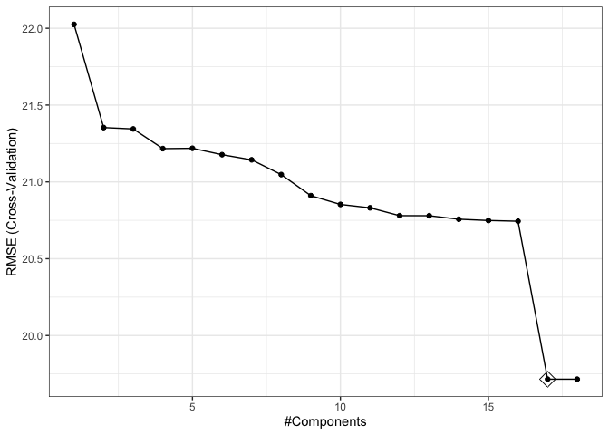

Analysis_Chen_Liang_cl4469
================
Chen Liang
2024-03-20

## Data preparation

``` r
# Load data
recov_df <- get(load("./data/recovery.RData")) |> 
  janitor::clean_names() |>
  na.omit() |>
  select(-id)

summary(recov_df)
```

    ##       age           gender       race     smoking      height     
    ##  Min.   :42.0   Min.   :0.0000   1:1967   0:1822   Min.   :147.8  
    ##  1st Qu.:57.0   1st Qu.:0.0000   2: 158   1: 859   1st Qu.:166.0  
    ##  Median :60.0   Median :0.0000   3: 604   2: 319   Median :169.9  
    ##  Mean   :60.2   Mean   :0.4853   4: 271            Mean   :169.9  
    ##  3rd Qu.:63.0   3rd Qu.:1.0000                     3rd Qu.:173.9  
    ##  Max.   :79.0   Max.   :1.0000                     Max.   :188.6  
    ##      weight            bmi         hypertension       diabetes     
    ##  Min.   : 55.90   Min.   :18.80   Min.   :0.0000   Min.   :0.0000  
    ##  1st Qu.: 75.20   1st Qu.:25.80   1st Qu.:0.0000   1st Qu.:0.0000  
    ##  Median : 79.80   Median :27.65   Median :0.0000   Median :0.0000  
    ##  Mean   : 79.96   Mean   :27.76   Mean   :0.4973   Mean   :0.1543  
    ##  3rd Qu.: 84.80   3rd Qu.:29.50   3rd Qu.:1.0000   3rd Qu.:0.0000  
    ##  Max.   :103.70   Max.   :38.90   Max.   :1.0000   Max.   :1.0000  
    ##       sbp             ldl           vaccine         severity    
    ##  Min.   :105.0   Min.   : 28.0   Min.   :0.000   Min.   :0.000  
    ##  1st Qu.:125.0   1st Qu.: 97.0   1st Qu.:0.000   1st Qu.:0.000  
    ##  Median :130.0   Median :110.0   Median :1.000   Median :0.000  
    ##  Mean   :130.5   Mean   :110.5   Mean   :0.596   Mean   :0.107  
    ##  3rd Qu.:136.0   3rd Qu.:124.0   3rd Qu.:1.000   3rd Qu.:0.000  
    ##  Max.   :156.0   Max.   :178.0   Max.   :1.000   Max.   :1.000  
    ##     study           recovery_time   
    ##  Length:3000        Min.   :  2.00  
    ##  Class :character   1st Qu.: 31.00  
    ##  Mode  :character   Median : 39.00  
    ##                     Mean   : 42.17  
    ##                     3rd Qu.: 49.00  
    ##                     Max.   :365.00

``` r
# Create a partition index.(training:test=80:20)
set.seed(2024)
train_index = createDataPartition(y = recov_df$recovery_time,
                                 p = 0.8,
                                 list = FALSE)
# Extract the training and test data
training_df = recov_df[train_index, ]
testing_df = recov_df[-train_index, ]

# Training data
x = model.matrix(recovery_time~.,training_df)[, -1]
y = training_df$recovery_time

# Testing data
x2 <- model.matrix(recovery_time~.,testing_df)[, -1]
y2 <- testing_df$recovery_time
```

## Linear Model

``` r
set.seed(2024)

# 10-fold cv
ctrl1 <- trainControl(method = "cv", number = 10)

# Fit Model
lm_fit <- train(x, y, method = "lm", trControl = ctrl1)
summary(lm_fit)
```

    ## 
    ## Call:
    ## lm(formula = .outcome ~ ., data = dat)
    ## 
    ## Residuals:
    ##     Min      1Q  Median      3Q     Max 
    ## -55.624 -10.775  -0.083   8.855 258.233 
    ## 
    ## Coefficients:
    ##                Estimate Std. Error t value Pr(>|t|)    
    ## (Intercept)  -2.182e+03  1.133e+02 -19.260  < 2e-16 ***
    ## age           2.114e-01  1.019e-01   2.075  0.03809 *  
    ## gender       -2.942e+00  8.106e-01  -3.630  0.00029 ***
    ## race2         6.251e-01  1.836e+00   0.341  0.73344    
    ## race3        -1.669e+00  1.034e+00  -1.614  0.10663    
    ## race4        -9.044e-01  1.444e+00  -0.626  0.53107    
    ## smoking1      1.981e+00  9.218e-01   2.149  0.03170 *  
    ## smoking2      2.960e+00  1.344e+00   2.202  0.02775 *  
    ## height        1.276e+01  6.648e-01  19.191  < 2e-16 ***
    ## weight       -1.385e+01  7.015e-01 -19.750  < 2e-16 ***
    ## bmi           4.149e+01  2.015e+00  20.598  < 2e-16 ***
    ## hypertension  2.320e+00  1.336e+00   1.736  0.08268 .  
    ## diabetes     -1.632e+00  1.126e+00  -1.449  0.14733    
    ## sbp           4.959e-02  8.640e-02   0.574  0.56608    
    ## ldl          -4.700e-02  2.162e-02  -2.174  0.02983 *  
    ## vaccine      -6.396e+00  8.244e-01  -7.758 1.27e-14 ***
    ## severity      7.918e+00  1.300e+00   6.092 1.29e-09 ***
    ## studyB        4.900e+00  8.601e-01   5.697 1.37e-08 ***
    ## ---
    ## Signif. codes:  0 '***' 0.001 '**' 0.01 '*' 0.05 '.' 0.1 ' ' 1
    ## 
    ## Residual standard error: 19.79 on 2384 degrees of freedom
    ## Multiple R-squared:  0.2597, Adjusted R-squared:  0.2544 
    ## F-statistic: 49.19 on 17 and 2384 DF,  p-value: < 2.2e-16

``` r
# Calculate test error
lm_test_pred <- predict(lm_fit, newdata = x2) # test dataset
lm_test_rmse <- sqrt(mean((lm_test_pred - y2)^2))
lm_test_rmse
```

    ## [1] 21.47581

## Lasso Model

``` r
set.seed(2024)

# Fit Model
lasso_fit <- train(x, y,
                   data= training_df,
                   method = "glmnet",
                   tuneGrid = expand.grid(alpha = 1, 
                                          lambda = exp(seq(5, -5, length = 100))),
                   trControl = ctrl1)
```

    ## Warning in nominalTrainWorkflow(x = x, y = y, wts = weights, info = trainInfo,
    ## : There were missing values in resampled performance measures.

``` r
# Plot RMSE and lambda
plot(lasso_fit, xTrans = log)
```

<!-- -->

``` r
# Check best tune
lasso_fit$bestTune
```

    ##   alpha      lambda
    ## 1     1 0.006737947

``` r
# Obtain coefficients in the final model
coef(lasso_fit$finalModel, s = lasso_fit$bestTune$lambda)
```

    ## 18 x 1 sparse Matrix of class "dgCMatrix"
    ##                         s1
    ## (Intercept)  -2.086847e+03
    ## age           2.111038e-01
    ## gender       -2.903129e+00
    ## race2         6.153220e-01
    ## race3        -1.643971e+00
    ## race4        -8.951082e-01
    ## smoking1      1.948664e+00
    ## smoking2      2.927867e+00
    ## height        1.219404e+01
    ## weight       -1.325814e+01
    ## bmi           3.978334e+01
    ## hypertension  2.304820e+00
    ## diabetes     -1.624339e+00
    ## sbp           4.977789e-02
    ## ldl          -4.650331e-02
    ## vaccine      -6.395969e+00
    ## severity      7.907612e+00
    ## studyB        4.905282e+00

``` r
# Calculate test error
lasso_test_pred <- predict(lasso_fit, newdata = x2)
lasso_test_rmse <- mean((lasso_test_pred - y2)^2)
lasso_test_rmse
```

    ## [1] 461.3265

## Elastic Net Model

``` r
set.seed(2024)

# Fit Model
enet_fit <- train(x, y,
                  data = training_df,
                  method = "glmnet",
                  tuneGrid = expand.grid(alpha = seq(0, 1, length = 21), 
                                         lambda = exp(seq(7, -3, length = 100))),
                  trControl = ctrl1)
```

    ## Warning in nominalTrainWorkflow(x = x, y = y, wts = weights, info = trainInfo,
    ## : There were missing values in resampled performance measures.

``` r
# Check best tune
enet_fit$bestTune
```

    ##      alpha     lambda
    ## 2001     1 0.04978707

``` r
# plot RMSE vs lambda and alpha
myCol <- rainbow(25)
myPar <- list(superpose.symbol = list(col = myCol),
              superpose.line = list(col = myCol))

plot(enet_fit, par.settings = myPar)
```

<!-- -->

``` r
# Obtain coefficients in the final model
coef(enet_fit$finalModel, enet_fit$bestTune$lambda)
```

    ## 18 x 1 sparse Matrix of class "dgCMatrix"
    ##                         s1
    ## (Intercept)  -1.655948e+03
    ## age           2.072535e-01
    ## gender       -2.702298e+00
    ## race2         5.218413e-01
    ## race3        -1.494128e+00
    ## race4        -7.975307e-01
    ## smoking1      1.766698e+00
    ## smoking2      2.728978e+00
    ## height        9.653888e+00
    ## weight       -1.057481e+01
    ## bmi           3.207384e+01
    ## hypertension  2.221762e+00
    ## diabetes     -1.557032e+00
    ## sbp           4.974952e-02
    ## ldl          -4.321739e-02
    ## vaccine      -6.370383e+00
    ## severity      7.827212e+00
    ## studyB        4.901177e+00

``` r
# Calculate test error
enet_test_pred <- predict(enet_fit, newdata = x2)
enet_test_rmse <- mean((enet_test_pred - y2)^2)
enet_test_rmse
```

    ## [1] 464.4851

## Ridge

``` r
set.seed(2024)

# Fit Model
ridge_fit <- train(x, y,
                   method = "glmnet", 
                   tuneGrid = expand.grid(alpha = 0,
                                          lambda = exp(seq(8, -1, length=100))),
                   trControl = ctrl1)

# plot RMSE
plot(ridge_fit, xTrans = log)
```

<!-- -->

``` r
# Check best tune
ridge_fit$bestTune
```

    ##   alpha    lambda
    ## 5     0 0.5292133

``` r
# Obtain coefficients in the final model
coef(ridge_fit$finalModel, s = ridge_fit$bestTune$lambda)
```

    ## 18 x 1 sparse Matrix of class "dgCMatrix"
    ##                         s1
    ## (Intercept)  -105.25903484
    ## age             0.22871415
    ## gender         -2.34223209
    ## race2           0.96528746
    ## race3          -1.51786231
    ## race4          -1.28760472
    ## smoking1        1.61478155
    ## smoking2        2.77224341
    ## height          0.50242173
    ## weight         -0.88976285
    ## bmi             4.21861393
    ## hypertension    2.06444017
    ## diabetes       -1.83506658
    ## sbp             0.06627462
    ## ldl            -0.04634671
    ## vaccine        -6.54140053
    ## severity        7.92539955
    ## studyB          5.18688722

``` r
# Calculate test error
ridge_test_pred <- predict(ridge_fit, newdata = x2)
ridge_test_mse <- mean((ridge_test_pred - y2)^2)
ridge_test_mse
```

    ## [1] 510.6402

## Principal Component Regression (PCR)

``` r
set.seed(2024)

# Fit Model
pcr_fit <-  train(x, y,
                  method = "pcr",
                  tuneGrid = data.frame(ncomp = 1:18),
                  trControl = ctrl1,
                  preProcess = c("center", "scale"))

# plot RMSE
ggplot(pcr_fit, highlight = TRUE) + theme_bw()
```

<!-- -->

``` r
# Check best tune
pcr_fit$bestTune
```

    ##    ncomp
    ## 17    17

``` r
# Obtain coefficients in the final model
coef(pcr_fit$finalModel, s = pcr_fit$bestTune)
```

    ## , , 17 comps
    ## 
    ##                 .outcome
    ## age            0.9423394
    ## gender        -1.4703745
    ## race2          0.1394040
    ## race3         -0.6684241
    ## race4         -0.2582503
    ## smoking1       0.8932190
    ## smoking2       0.9120685
    ## height        75.5422689
    ## weight       -98.5058071
    ## bmi          115.9812842
    ## hypertension   1.1603216
    ## diabetes      -0.5865935
    ## sbp            0.3979801
    ## ldl           -0.9186050
    ## vaccine       -3.1478891
    ## severity       2.4728924
    ## studyB         2.3055598

``` r
# Calculate test error
pcr_test_pred <- predict(pcr_fit, newdata = x2)
pcr_test_mse <- mean((pcr_test_pred - y2)^2)
pcr_test_mse
```

    ## [1] 461.2106

## Partial Least Squares model (PLS)

``` r
set.seed(2024)

# Fit Model
pls_fit <- train(x, y,
                 method = "pls",
                 tuneGrid = data.frame(ncomp = 1:17),
                 trControl = ctrl1,
                 preProcess = c("center", "scale"))

# Plot RMSE
ggplot(pls_fit, highlight = TRUE)
```

<!-- -->

``` r
# Check best tune
pls_fit$bestTune
```

    ##    ncomp
    ## 10    10

``` r
# Obtain coefficients in the final model
coef(pls_fit$finalModel, s = pls_fit$bestTune)
```

    ## , , 10 comps
    ## 
    ##                 .outcome
    ## age            0.9395515
    ## gender        -1.4652037
    ## race2          0.1333538
    ## race3         -0.6746239
    ## race4         -0.2570572
    ## smoking1       0.8926571
    ## smoking2       0.9121369
    ## height        75.5403795
    ## weight       -98.5066328
    ## bmi          115.9809974
    ## hypertension   1.1597094
    ## diabetes      -0.5799247
    ## sbp            0.3966856
    ## ldl           -0.9113583
    ## vaccine       -3.1481168
    ## severity       2.4789959
    ## studyB         2.3055630

``` r
# Calculate test error
pls_test_pred <- predict(pls_fit, newdata = x2) 
pls_test_mse <- mean((pls_test_pred - y2)^2)
pls_test_mse
```

    ## [1] 461.2433

## GAM

``` r
set.seed(2024)

# Fit Model
gam_fit = train(x, y,
                method = "gam",   
                tuneGrid = data.frame(method = "GCV.Cp",
                                      select = c(TRUE, FALSE)),
                trControl = ctrl1)

# Parameters that fit the best model
gam_fit$bestTune
```

    ##   select method
    ## 1  FALSE GCV.Cp

``` r
gam_fit$finalModel
```

    ## 
    ## Family: gaussian 
    ## Link function: identity 
    ## 
    ## Formula:
    ## .outcome ~ gender + race2 + race3 + race4 + smoking1 + smoking2 + 
    ##     hypertension + diabetes + vaccine + severity + studyB + s(age) + 
    ##     s(sbp) + s(ldl) + s(bmi) + s(height) + s(weight)
    ## 
    ## Estimated degrees of freedom:
    ## 1.00 1.00 1.00 7.46 7.95 1.00  total = 31.4 
    ## 
    ## GCV score: 349.178

``` r
# View the model summary
summary(gam_fit$finalModel)
```

    ## 
    ## Family: gaussian 
    ## Link function: identity 
    ## 
    ## Formula:
    ## .outcome ~ gender + race2 + race3 + race4 + smoking1 + smoking2 + 
    ##     hypertension + diabetes + vaccine + severity + studyB + s(age) + 
    ##     s(sbp) + s(ldl) + s(bmi) + s(height) + s(weight)
    ## 
    ## Parametric coefficients:
    ##              Estimate Std. Error t value Pr(>|t|)    
    ## (Intercept)   43.5506     1.0681  40.776  < 2e-16 ***
    ## gender        -3.2725     0.7625  -4.292 1.84e-05 ***
    ## race2          0.5097     1.7285   0.295   0.7681    
    ## race3         -1.5887     0.9728  -1.633   0.1026    
    ## race4         -0.9136     1.3585  -0.673   0.5013    
    ## smoking1       2.0986     0.8663   2.423   0.0155 *  
    ## smoking2       3.5623     1.2648   2.816   0.0049 ** 
    ## hypertension   2.3060     1.2578   1.833   0.0669 .  
    ## diabetes      -1.6315     1.0585  -1.541   0.1234    
    ## vaccine       -6.3523     0.7759  -8.187 4.31e-16 ***
    ## severity       7.9027     1.2215   6.469 1.19e-10 ***
    ## studyB         4.6159     0.8086   5.709 1.28e-08 ***
    ## ---
    ## Signif. codes:  0 '***' 0.001 '**' 0.01 '*' 0.05 '.' 0.1 ' ' 1
    ## 
    ## Approximate significance of smooth terms:
    ##             edf Ref.df      F  p-value    
    ## s(age)    1.000  1.000  1.570 0.210380    
    ## s(sbp)    1.000  1.000  0.166 0.683927    
    ## s(ldl)    1.000  1.000  3.666 0.055657 .  
    ## s(bmi)    7.457  8.358 65.449  < 2e-16 ***
    ## s(height) 7.947  8.685 12.294  < 2e-16 ***
    ## s(weight) 1.000  1.000 14.381 0.000153 ***
    ## ---
    ## Signif. codes:  0 '***' 0.001 '**' 0.01 '*' 0.05 '.' 0.1 ' ' 1
    ## 
    ## R-sq.(adj) =  0.344   Deviance explained = 35.2%
    ## GCV = 349.18  Scale est. = 344.61    n = 2402

``` r
# Calculate test error
gam_test_pred <- predict(gam_fit, newdata = x2)
gam_test_mse <- mean((gam_test_pred - y2)^2)
gam_test_mse
```

    ## [1] 409.4947

## Multivariate Adaptive Regression Splines (MARS)

``` r
set.seed(2024)

mars_grid <- expand.grid(degree = 1:3,
                         nprune = 2:26)

mars_fit <- train(x, y,
                  method = "earth",
                  tuneGrid = mars_grid,
                  trControl = ctrl1)

# Plot RMSE
ggplot(mars_fit, highlight = T)
```

<!-- -->

``` r
# Parameters that fit the best model
mars_fit$bestTune
```

    ##    nprune degree
    ## 42     18      2

``` r
coef(mars_fit$finalModel)
```

    ##                   (Intercept)                   h(bmi-30.8) 
    ##                 -134.95923527                  -24.91874630 
    ##                   h(30.8-bmi)          h(bmi-30.8) * studyB 
    ##                   19.93223441                   17.01245024 
    ## h(height-159.5) * h(bmi-30.8) h(159.5-height) * h(bmi-30.8) 
    ##                   -0.55722369                    2.28977653 
    ##                   h(bmi-25.3)                       vaccine 
    ##                    4.56922378                   -4.55632324 
    ##      h(bmi-30.8) * h(ldl-104)      h(bmi-30.8) * h(104-ldl) 
    ##                    0.14027416                    0.34957628 
    ##  h(85.5-weight) * h(bmi-30.8)                        gender 
    ##                   -2.59956833                   -3.11745328 
    ##      h(158-height) * severity             severity * studyB 
    ##                   10.68088528                   15.46411845 
    ##      h(bmi-25.3) * h(139-sbp)              vaccine * studyB 
    ##                   -0.06087514                   -4.12553822 
    ##                   h(bmi-21.3)                   h(bmi-29.5) 
    ##                   16.50474700                    5.80857644

## Model Comparing

``` r
# resample
resamp <- resamples(list(
  lm = lm_fit,
  lasso = lasso_fit,
  ridge = ridge_fit,
  elastic_net = enet_fit,
  pcr = pcr_fit,
  pls = pls_fit,
  gam = gam_fit,
  mars = mars_fit
))

summary(resamp)
```

    ## 
    ## Call:
    ## summary.resamples(object = resamp)
    ## 
    ## Models: lm, lasso, ridge, elastic_net, pcr, pls, gam, mars 
    ## Number of resamples: 10 
    ## 
    ## MAE 
    ##                 Min.  1st Qu.   Median     Mean  3rd Qu.     Max. NA's
    ## lm          12.65827 12.98201 13.14044 13.24961 13.40682 14.08860    0
    ## lasso       12.58753 12.93753 13.07802 13.19703 13.36130 14.03338    0
    ## ridge       12.43772 12.91646 13.44438 13.28629 13.64266 13.86450    0
    ## elastic_net 12.39675 12.73068 12.87723 13.01278 13.19290 13.82902    0
    ## pcr         12.65827 12.98201 13.14044 13.24961 13.40682 14.08860    0
    ## pls         12.65860 12.98145 13.13910 13.24949 13.40785 14.08853    0
    ## gam         12.02371 12.11518 12.64794 12.67120 13.11409 13.61163    0
    ## mars        11.03567 11.44323 12.43141 12.11802 12.65317 12.97444    0
    ## 
    ## RMSE 
    ##                 Min.  1st Qu.   Median     Mean  3rd Qu.     Max. NA's
    ## lm          17.41034 18.19047 19.31259 19.80930 20.28848 25.11340    0
    ## lasso       17.33271 18.18750 19.28360 19.80825 20.34108 25.18673    0
    ## ridge       17.10442 19.51358 19.91044 21.06982 22.74103 27.51605    0
    ## elastic_net 17.05512 18.26359 19.21957 19.87933 20.66824 25.58520    0
    ## pcr         17.41034 18.19047 19.31259 19.80930 20.28848 25.11340    0
    ## pls         17.41074 18.18978 19.31360 19.80881 20.28669 25.11381    0
    ## gam         16.90154 18.19722 18.38978 19.28520 20.10106 22.89854    0
    ## mars        15.50036 15.93019 18.50061 18.00871 19.26472 21.62617    0
    ## 
    ## Rsquared 
    ##                   Min.   1st Qu.    Median      Mean   3rd Qu.      Max. NA's
    ## lm          0.12788184 0.1698379 0.2354838 0.2410852 0.3227967 0.3823306    0
    ## lasso       0.12780359 0.1702795 0.2337423 0.2407865 0.3225846 0.3814517    0
    ## ridge       0.06822310 0.0994765 0.1278933 0.1421557 0.1819024 0.2515319    0
    ## elastic_net 0.12562264 0.1682808 0.2220135 0.2360842 0.3168461 0.3723871    0
    ## pcr         0.12788184 0.1698379 0.2354838 0.2410852 0.3227967 0.3823306    0
    ## pls         0.12788804 0.1698055 0.2355930 0.2411219 0.3228657 0.3824693    0
    ## gam         0.08785856 0.1920850 0.2634086 0.2999918 0.4191649 0.5086967    0
    ## mars        0.10359889 0.2527592 0.3128814 0.3728295 0.5470816 0.6313411    0

``` r
# visualization
bwplot(resamp, metric = "RMSE")
```

<!-- -->
