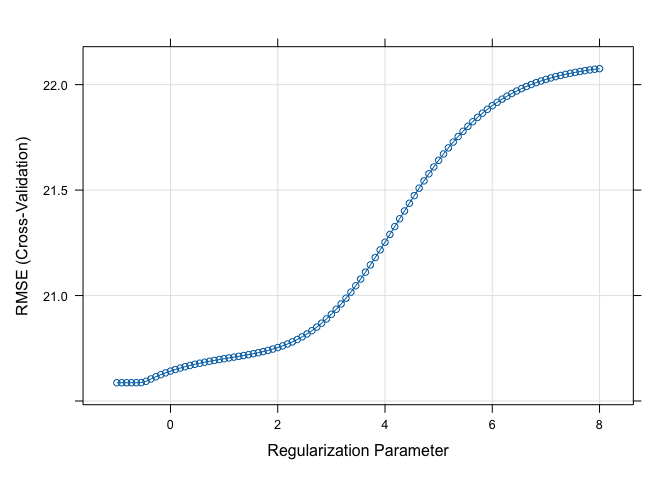

Analysis_Chen_Liang_cl4469
================
Chen Liang
2024-03-20

## Data preparation

``` r
# Load data
recov_df <- get(load("./data/recovery.RData")) |> 
  janitor::clean_names() |>
  na.omit() |>
  select(-id)

summary(recov_df)
```

    ##       age           gender       race     smoking      height     
    ##  Min.   :42.0   Min.   :0.0000   1:1967   0:1822   Min.   :147.8  
    ##  1st Qu.:57.0   1st Qu.:0.0000   2: 158   1: 859   1st Qu.:166.0  
    ##  Median :60.0   Median :0.0000   3: 604   2: 319   Median :169.9  
    ##  Mean   :60.2   Mean   :0.4853   4: 271            Mean   :169.9  
    ##  3rd Qu.:63.0   3rd Qu.:1.0000                     3rd Qu.:173.9  
    ##  Max.   :79.0   Max.   :1.0000                     Max.   :188.6  
    ##      weight            bmi         hypertension       diabetes     
    ##  Min.   : 55.90   Min.   :18.80   Min.   :0.0000   Min.   :0.0000  
    ##  1st Qu.: 75.20   1st Qu.:25.80   1st Qu.:0.0000   1st Qu.:0.0000  
    ##  Median : 79.80   Median :27.65   Median :0.0000   Median :0.0000  
    ##  Mean   : 79.96   Mean   :27.76   Mean   :0.4973   Mean   :0.1543  
    ##  3rd Qu.: 84.80   3rd Qu.:29.50   3rd Qu.:1.0000   3rd Qu.:0.0000  
    ##  Max.   :103.70   Max.   :38.90   Max.   :1.0000   Max.   :1.0000  
    ##       sbp             ldl           vaccine         severity    
    ##  Min.   :105.0   Min.   : 28.0   Min.   :0.000   Min.   :0.000  
    ##  1st Qu.:125.0   1st Qu.: 97.0   1st Qu.:0.000   1st Qu.:0.000  
    ##  Median :130.0   Median :110.0   Median :1.000   Median :0.000  
    ##  Mean   :130.5   Mean   :110.5   Mean   :0.596   Mean   :0.107  
    ##  3rd Qu.:136.0   3rd Qu.:124.0   3rd Qu.:1.000   3rd Qu.:0.000  
    ##  Max.   :156.0   Max.   :178.0   Max.   :1.000   Max.   :1.000  
    ##     study           recovery_time   
    ##  Length:3000        Min.   :  2.00  
    ##  Class :character   1st Qu.: 31.00  
    ##  Mode  :character   Median : 39.00  
    ##                     Mean   : 42.17  
    ##                     3rd Qu.: 49.00  
    ##                     Max.   :365.00

``` r
# Create a partition index.(training:test=80:20)
set.seed(2024)
train_index = createDataPartition(y = recov_df$recovery_time,
                                 p = 0.8,
                                 list = FALSE)
# Extract the training and test data
training_df = recov_df[train_index, ]
testing_df = recov_df[-train_index, ]

# Training data
x = model.matrix(recovery_time~.,training_df)[, -1]
y = training_df$recovery_time

# Testing data
x2 <- model.matrix(recovery_time~.,testing_df)[, -1]
y2 <- testing_df$recovery_time
```

## Linear Model

``` r
set.seed(2024)

# 10-fold cv
ctrl1 <- trainControl(method = "cv", number = 10)

# Fit Model
lm_fit <- train(x, y, method = "lm", trControl = ctrl1)
summary(lm_fit)
```

    ## 
    ## Call:
    ## lm(formula = .outcome ~ ., data = dat)
    ## 
    ## Residuals:
    ##     Min      1Q  Median      3Q     Max 
    ## -55.624 -10.775  -0.083   8.855 258.233 
    ## 
    ## Coefficients:
    ##                Estimate Std. Error t value Pr(>|t|)    
    ## (Intercept)  -2.182e+03  1.133e+02 -19.260  < 2e-16 ***
    ## age           2.114e-01  1.019e-01   2.075  0.03809 *  
    ## gender       -2.942e+00  8.106e-01  -3.630  0.00029 ***
    ## race2         6.251e-01  1.836e+00   0.341  0.73344    
    ## race3        -1.669e+00  1.034e+00  -1.614  0.10663    
    ## race4        -9.044e-01  1.444e+00  -0.626  0.53107    
    ## smoking1      1.981e+00  9.218e-01   2.149  0.03170 *  
    ## smoking2      2.960e+00  1.344e+00   2.202  0.02775 *  
    ## height        1.276e+01  6.648e-01  19.191  < 2e-16 ***
    ## weight       -1.385e+01  7.015e-01 -19.750  < 2e-16 ***
    ## bmi           4.149e+01  2.015e+00  20.598  < 2e-16 ***
    ## hypertension  2.320e+00  1.336e+00   1.736  0.08268 .  
    ## diabetes     -1.632e+00  1.126e+00  -1.449  0.14733    
    ## sbp           4.959e-02  8.640e-02   0.574  0.56608    
    ## ldl          -4.700e-02  2.162e-02  -2.174  0.02983 *  
    ## vaccine      -6.396e+00  8.244e-01  -7.758 1.27e-14 ***
    ## severity      7.918e+00  1.300e+00   6.092 1.29e-09 ***
    ## studyB        4.900e+00  8.601e-01   5.697 1.37e-08 ***
    ## ---
    ## Signif. codes:  0 '***' 0.001 '**' 0.01 '*' 0.05 '.' 0.1 ' ' 1
    ## 
    ## Residual standard error: 19.79 on 2384 degrees of freedom
    ## Multiple R-squared:  0.2597, Adjusted R-squared:  0.2544 
    ## F-statistic: 49.19 on 17 and 2384 DF,  p-value: < 2.2e-16

``` r
# Calculate test error
lm_test_pred <- predict(lm_fit, newdata = x2) # test dataset
lm_test_rmse <- sqrt(mean((lm_test_pred - y2)^2))
lm_test_rmse
```

    ## [1] 21.47581

## Lasso Model

``` r
set.seed(2024)

# Fit Model
lasso_fit <- train(x, y,
                   data= training_df,
                   method = "glmnet",
                   tuneGrid = expand.grid(alpha = 1, 
                                          lambda = exp(seq(5, -5, length = 100))),
                   trControl = ctrl1)
```

    ## Warning in nominalTrainWorkflow(x = x, y = y, wts = weights, info = trainInfo,
    ## : There were missing values in resampled performance measures.

``` r
# Plot RMSE and lambda
plot(lasso_fit, xTrans = log)
```

<!-- -->

``` r
# Check best tune
lasso_fit$bestTune
```

    ##   alpha      lambda
    ## 1     1 0.006737947

``` r
# Obtain coefficients in the final model
coef(lasso_fit$finalModel, s = lasso_fit$bestTune$lambda)
```

    ## 18 x 1 sparse Matrix of class "dgCMatrix"
    ##                         s1
    ## (Intercept)  -2.086847e+03
    ## age           2.111038e-01
    ## gender       -2.903129e+00
    ## race2         6.153220e-01
    ## race3        -1.643971e+00
    ## race4        -8.951082e-01
    ## smoking1      1.948664e+00
    ## smoking2      2.927867e+00
    ## height        1.219404e+01
    ## weight       -1.325814e+01
    ## bmi           3.978334e+01
    ## hypertension  2.304820e+00
    ## diabetes     -1.624339e+00
    ## sbp           4.977789e-02
    ## ldl          -4.650331e-02
    ## vaccine      -6.395969e+00
    ## severity      7.907612e+00
    ## studyB        4.905282e+00

``` r
# Calculate test error
lasso_test_pred <- predict(lasso_fit, newdata = x2)
lasso_test_rmse <- mean((lasso_test_pred - y2)^2)
lasso_test_rmse
```

    ## [1] 461.3265

## Elastic Net Model

``` r
set.seed(2024)

# Fit Model
enet_fit <- train(x, y,
                  data = training_df,
                  method = "glmnet",
                  tuneGrid = expand.grid(alpha = seq(0, 1, length = 21), 
                                         lambda = exp(seq(7, -3, length = 100))),
                  trControl = ctrl1)
```

    ## Warning in nominalTrainWorkflow(x = x, y = y, wts = weights, info = trainInfo,
    ## : There were missing values in resampled performance measures.

``` r
# Check best tune
enet_fit$bestTune
```

    ##      alpha     lambda
    ## 2001     1 0.04978707

``` r
# plot RMSE vs lambda and alpha
myCol <- rainbow(25)
myPar <- list(superpose.symbol = list(col = myCol),
              superpose.line = list(col = myCol))

plot(enet_fit, par.settings = myPar)
```

<!-- -->

``` r
# Obtain coefficients in the final model
coef(enet_fit$finalModel, enet_fit$bestTune$lambda)
```

    ## 18 x 1 sparse Matrix of class "dgCMatrix"
    ##                         s1
    ## (Intercept)  -1.655948e+03
    ## age           2.072535e-01
    ## gender       -2.702298e+00
    ## race2         5.218413e-01
    ## race3        -1.494128e+00
    ## race4        -7.975307e-01
    ## smoking1      1.766698e+00
    ## smoking2      2.728978e+00
    ## height        9.653888e+00
    ## weight       -1.057481e+01
    ## bmi           3.207384e+01
    ## hypertension  2.221762e+00
    ## diabetes     -1.557032e+00
    ## sbp           4.974952e-02
    ## ldl          -4.321739e-02
    ## vaccine      -6.370383e+00
    ## severity      7.827212e+00
    ## studyB        4.901177e+00

``` r
# Calculate test error
enet_test_pred <- predict(enet_fit, newdata = x2)
enet_test_rmse <- mean((enet_test_pred - y2)^2)
enet_test_rmse
```

    ## [1] 464.4851

## Ridge

``` r
set.seed(2024)

# Fit Model
ridge_fit <- train(x, y,
                   method = "glmnet", 
                   tuneGrid = expand.grid(alpha = 0,
                                          lambda = exp(seq(8, -1, length=100))),
                   trControl = ctrl1)

plot(ridge_fit, xTrans = log)
```

<!-- -->

``` r
# Check best tune
ridge_fit$bestTune
```

    ##   alpha    lambda
    ## 5     0 0.5292133

``` r
# Obtain coefficients in the final model
coef(ridge_fit$finalModel, s = ridge_fit$bestTune$lambda)
```

    ## 18 x 1 sparse Matrix of class "dgCMatrix"
    ##                         s1
    ## (Intercept)  -105.25903484
    ## age             0.22871415
    ## gender         -2.34223209
    ## race2           0.96528746
    ## race3          -1.51786231
    ## race4          -1.28760472
    ## smoking1        1.61478155
    ## smoking2        2.77224341
    ## height          0.50242173
    ## weight         -0.88976285
    ## bmi             4.21861393
    ## hypertension    2.06444017
    ## diabetes       -1.83506658
    ## sbp             0.06627462
    ## ldl            -0.04634671
    ## vaccine        -6.54140053
    ## severity        7.92539955
    ## studyB          5.18688722

``` r
# Calculate test error
ridge_test_pred <- predict(ridge_fit, newdata = x2)
ridge_test_mse <- mean((ridge_test_pred - y2)^2)
ridge_test_mse
```

    ## [1] 510.6402
