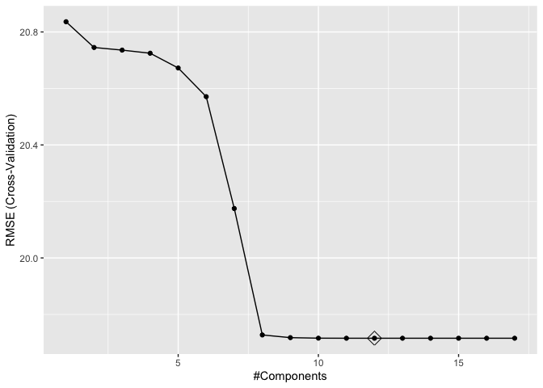
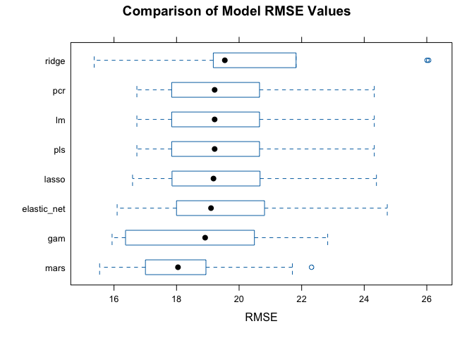

Analysis_Chen_Liang_cl4469
================
Chen Liang
2024-03-20

## Data preparation

``` r
# Load data
recov_df <- get(load("./data/recovery.RData")) |> 
  janitor::clean_names() |>
  na.omit()

summary(recov_df)
```

    ##        id              age           gender       race     smoking 
    ##  Min.   :   1.0   Min.   :42.0   Min.   :0.0000   1:1967   0:1822  
    ##  1st Qu.: 750.8   1st Qu.:57.0   1st Qu.:0.0000   2: 158   1: 859  
    ##  Median :1500.5   Median :60.0   Median :0.0000   3: 604   2: 319  
    ##  Mean   :1500.5   Mean   :60.2   Mean   :0.4853   4: 271           
    ##  3rd Qu.:2250.2   3rd Qu.:63.0   3rd Qu.:1.0000                    
    ##  Max.   :3000.0   Max.   :79.0   Max.   :1.0000                    
    ##      height          weight            bmi         hypertension   
    ##  Min.   :147.8   Min.   : 55.90   Min.   :18.80   Min.   :0.0000  
    ##  1st Qu.:166.0   1st Qu.: 75.20   1st Qu.:25.80   1st Qu.:0.0000  
    ##  Median :169.9   Median : 79.80   Median :27.65   Median :0.0000  
    ##  Mean   :169.9   Mean   : 79.96   Mean   :27.76   Mean   :0.4973  
    ##  3rd Qu.:173.9   3rd Qu.: 84.80   3rd Qu.:29.50   3rd Qu.:1.0000  
    ##  Max.   :188.6   Max.   :103.70   Max.   :38.90   Max.   :1.0000  
    ##     diabetes           sbp             ldl           vaccine     
    ##  Min.   :0.0000   Min.   :105.0   Min.   : 28.0   Min.   :0.000  
    ##  1st Qu.:0.0000   1st Qu.:125.0   1st Qu.: 97.0   1st Qu.:0.000  
    ##  Median :0.0000   Median :130.0   Median :110.0   Median :1.000  
    ##  Mean   :0.1543   Mean   :130.5   Mean   :110.5   Mean   :0.596  
    ##  3rd Qu.:0.0000   3rd Qu.:136.0   3rd Qu.:124.0   3rd Qu.:1.000  
    ##  Max.   :1.0000   Max.   :156.0   Max.   :178.0   Max.   :1.000  
    ##     severity        study           recovery_time   
    ##  Min.   :0.000   Length:3000        Min.   :  2.00  
    ##  1st Qu.:0.000   Class :character   1st Qu.: 31.00  
    ##  Median :0.000   Mode  :character   Median : 39.00  
    ##  Mean   :0.107                      Mean   : 42.17  
    ##  3rd Qu.:0.000                      3rd Qu.: 49.00  
    ##  Max.   :1.000                      Max.   :365.00

``` r
# Create a partition index.(training:test=80:20)
set.seed(2024)
train_index = initial_split(recov_df, prop = .80)

# Extract the training and test data
training_df = training(train_index) |>select(-id)
testing_df = testing(train_index) |>select(-id)
# Training data
x = model.matrix(recovery_time~.,training_df)[, -1]
y = training_df$recovery_time

# Testing data
x2 <- model.matrix(recovery_time~.,testing_df)[, -1]
y2 <- testing_df$recovery_time
```

## Linear Model

``` r
set.seed(2024)

# 10-fold cv
ctrl1 <- trainControl(method = "cv", number = 10)

# Fit Model
lm_fit <- train(x, y, method = "lm", trControl = ctrl1)
summary(lm_fit)
```

    ## 
    ## Call:
    ## lm(formula = .outcome ~ ., data = dat)
    ## 
    ## Residuals:
    ##     Min      1Q  Median      3Q     Max 
    ## -53.037 -10.712  -0.508   8.268 263.578 
    ## 
    ## Coefficients:
    ##                Estimate Std. Error t value Pr(>|t|)    
    ## (Intercept)  -1.893e+03  1.155e+02 -16.381  < 2e-16 ***
    ## age           3.024e-01  1.023e-01   2.955 0.003153 ** 
    ## gender       -2.988e+00  8.089e-01  -3.694 0.000226 ***
    ## race2         3.388e+00  1.822e+00   1.859 0.063138 .  
    ## race3        -6.868e-01  1.027e+00  -0.669 0.503720    
    ## race4        -1.427e+00  1.472e+00  -0.969 0.332428    
    ## smoking1      1.749e+00  9.148e-01   1.912 0.055966 .  
    ## smoking2      3.533e+00  1.344e+00   2.628 0.008635 ** 
    ## height        1.102e+01  6.773e-01  16.276  < 2e-16 ***
    ## weight       -1.193e+01  7.152e-01 -16.680  < 2e-16 ***
    ## bmi           3.608e+01  2.054e+00  17.568  < 2e-16 ***
    ## hypertension  2.690e+00  1.325e+00   2.030 0.042449 *  
    ## diabetes     -1.670e+00  1.133e+00  -1.474 0.140535    
    ## sbp          -6.707e-04  8.631e-02  -0.008 0.993800    
    ## ldl          -2.969e-02  2.132e-02  -1.393 0.163882    
    ## vaccine      -6.301e+00  8.250e-01  -7.638 3.18e-14 ***
    ## severity      5.917e+00  1.301e+00   4.549 5.67e-06 ***
    ## studyB        5.057e+00  8.613e-01   5.871 4.94e-09 ***
    ## ---
    ## Signif. codes:  0 '***' 0.001 '**' 0.01 '*' 0.05 '.' 0.1 ' ' 1
    ## 
    ## Residual standard error: 19.77 on 2382 degrees of freedom
    ## Multiple R-squared:  0.2256, Adjusted R-squared:   0.22 
    ## F-statistic: 40.81 on 17 and 2382 DF,  p-value: < 2.2e-16

``` r
# Calculate test error
lm_test_pred <- predict(lm_fit, newdata = x2) 
lm_test_rmse <- sqrt(mean((lm_test_pred - y2)^2))
lm_test_rmse
```

    ## [1] 21.70729

## Lasso Model

``` r
set.seed(2024)

# Fit Model
lasso_fit <- train(x, y,
                   data= training_df,
                   method = "glmnet",
                   tuneGrid = expand.grid(alpha = 1, 
                                          lambda = exp(seq(5, -5, length = 100))),
                   trControl = ctrl1)
```

    ## Warning in nominalTrainWorkflow(x = x, y = y, wts = weights, info = trainInfo,
    ## : There were missing values in resampled performance measures.

``` r
# Plot RMSE and lambda
plot(lasso_fit, xTrans = log)
```

<!-- -->

``` r
# Check best tune
lasso_fit$bestTune
```

    ##   alpha      lambda
    ## 2     1 0.007454109

``` r
# Obtain coefficients in the final model
coef(lasso_fit$finalModel, s = lasso_fit$bestTune$lambda)
```

    ## 18 x 1 sparse Matrix of class "dgCMatrix"
    ##                         s1
    ## (Intercept)  -1.786727e+03
    ## age           3.031362e-01
    ## gender       -2.972141e+00
    ## race2         3.382522e+00
    ## race3        -6.654586e-01
    ## race4        -1.424497e+00
    ## smoking1      1.719034e+00
    ## smoking2      3.466992e+00
    ## height        1.039828e+01
    ## weight       -1.126692e+01
    ## bmi           3.417931e+01
    ## hypertension  2.675531e+00
    ## diabetes     -1.670466e+00
    ## sbp           .           
    ## ldl          -2.914713e-02
    ## vaccine      -6.297203e+00
    ## severity      5.876002e+00
    ## studyB        5.042943e+00

``` r
# Calculate test error
lasso_test_pred <- predict(lasso_fit, newdata = x2)
lasso_test_rmse <- mean((lasso_test_pred - y2)^2)
lasso_test_rmse
```

    ## [1] 475.4402

## Elastic Net Model

``` r
set.seed(2024)

# Fit Model
enet_fit <- train(x, y,
                  data = training_df,
                  method = "glmnet",
                  tuneGrid = expand.grid(alpha = seq(0, 1, length = 21), 
                                         lambda = exp(seq(7, -3, length = 100))),
                  trControl = ctrl1)
```

    ## Warning in nominalTrainWorkflow(x = x, y = y, wts = weights, info = trainInfo,
    ## : There were missing values in resampled performance measures.

``` r
# Check best tune
enet_fit$bestTune
```

    ##      alpha     lambda
    ## 2001     1 0.04978707

``` r
# plot RMSE vs lambda and alpha
myCol <- rainbow(25)
myPar <- list(superpose.symbol = list(col = myCol),
              superpose.line = list(col = myCol))

plot(enet_fit, par.settings = myPar)
```

<!-- -->

``` r
# Obtain coefficients in the final model
coef(enet_fit$finalModel, enet_fit$bestTune$lambda)
```

    ## 18 x 1 sparse Matrix of class "dgCMatrix"
    ##                         s1
    ## (Intercept)  -1.345823e+03
    ## age           3.044083e-01
    ## gender       -2.884762e+00
    ## race2         3.324496e+00
    ## race3        -5.441131e-01
    ## race4        -1.360138e+00
    ## smoking1      1.561219e+00
    ## smoking2      3.142061e+00
    ## height        7.797840e+00
    ## weight       -8.517852e+00
    ## bmi           2.628087e+01
    ## hypertension  2.624536e+00
    ## diabetes     -1.641080e+00
    ## sbp           .           
    ## ldl          -2.593299e-02
    ## vaccine      -6.257870e+00
    ## severity      5.671095e+00
    ## studyB        4.960433e+00

``` r
# Calculate test error
enet_test_pred <- predict(enet_fit, newdata = x2)
enet_test_rmse <- mean((enet_test_pred - y2)^2)
enet_test_rmse
```

    ## [1] 496.3542

## Ridge

``` r
set.seed(2024)

# Fit Model
ridge_fit <- train(x, y,
                   method = "glmnet", 
                   tuneGrid = expand.grid(alpha = 0,
                                          lambda = exp(seq(8, -1, length=100))),
                   trControl = ctrl1)

# plot RMSE
plot(ridge_fit, xTrans = log)
```

<!-- -->

``` r
# Check best tune
ridge_fit$bestTune
```

    ##   alpha    lambda
    ## 5     0 0.5292133

``` r
# Obtain coefficients in the final model
coef(ridge_fit$finalModel, s = ridge_fit$bestTune$lambda)
```

    ## 18 x 1 sparse Matrix of class "dgCMatrix"
    ##                         s1
    ## (Intercept)  -88.793877369
    ## age            0.337716864
    ## gender        -2.887487626
    ## race2          3.653136318
    ## race3         -0.670122648
    ## race4         -1.893301307
    ## smoking1       1.533851174
    ## smoking2       2.852821090
    ## height         0.388447289
    ## weight        -0.672787548
    ## bmi            3.714325264
    ## hypertension   2.787728002
    ## diabetes      -1.968811271
    ## sbp           -0.004322627
    ## ldl           -0.028329531
    ## vaccine       -6.350093251
    ## severity       5.448595072
    ## studyB         4.965623471

``` r
# Calculate test error
ridge_test_pred <- predict(ridge_fit, newdata = x2)
ridge_test_mse <- mean((ridge_test_pred - y2)^2)
ridge_test_mse
```

    ## [1] 584.6444

## Principal Component Regression (PCR)

``` r
set.seed(2024)

# Fit Model
pcr_fit <-  train(x, y,
                  method = "pcr",
                  tuneGrid = data.frame(ncomp = 1:18),
                  trControl = ctrl1,
                  preProcess = c("center", "scale"))

# plot RMSE
ggplot(pcr_fit, highlight = TRUE) + theme_bw()
```

<!-- -->

``` r
# Check best tune
pcr_fit$bestTune
```

    ##    ncomp
    ## 17    17

``` r
# Obtain coefficients in the final model
coef(pcr_fit$finalModel, s = pcr_fit$bestTune)
```

    ## , , 17 comps
    ## 
    ##                   .outcome
    ## age            1.345229648
    ## gender        -1.493769451
    ## race2          0.761325281
    ## race3         -0.276690264
    ## race4         -0.399028343
    ## smoking1       0.795261992
    ## smoking2       1.090904515
    ## height        65.818417321
    ## weight       -85.066995624
    ## bmi          100.591853512
    ## hypertension   1.345339735
    ## diabetes      -0.596426494
    ## sbp           -0.005358771
    ## ldl           -0.586903327
    ## vaccine       -3.095789007
    ## severity       1.842629752
    ## studyB         2.374295409

``` r
# Calculate test error
pcr_test_pred <- predict(pcr_fit, newdata = x2)
pcr_test_mse <- mean((pcr_test_pred - y2)^2)
pcr_test_mse
```

    ## [1] 471.2063

## Partial Least Squares model (PLS)

``` r
set.seed(2024)

# Fit Model
pls_fit <- train(x, y,
                 method = "pls",
                 tuneGrid = data.frame(ncomp = 1:17),
                 trControl = ctrl1,
                 preProcess = c("center", "scale"))

# Plot RMSE
ggplot(pls_fit, highlight = TRUE)
```

<!-- -->

``` r
# Check best tune
pls_fit$bestTune
```

    ##    ncomp
    ## 12    12

``` r
# Obtain coefficients in the final model
coef(pls_fit$finalModel, s = pls_fit$bestTune)
```

    ## , , 12 comps
    ## 
    ##                   .outcome
    ## age            1.345158171
    ## gender        -1.493772824
    ## race2          0.761188904
    ## race3         -0.276878330
    ## race4         -0.399096705
    ## smoking1       0.795166426
    ## smoking2       1.090788616
    ## height        65.818448742
    ## weight       -85.066976536
    ## bmi          100.591848304
    ## hypertension   1.345385989
    ## diabetes      -0.596479918
    ## sbp           -0.005320082
    ## ldl           -0.586950522
    ## vaccine       -3.095844913
    ## severity       1.842596287
    ## studyB         2.374347318

``` r
# Calculate test error
pls_test_pred <- predict(pls_fit, newdata = x2) 
pls_test_mse <- mean((pls_test_pred - y2)^2)
pls_test_mse
```

    ## [1] 471.2062

## GAM

``` r
set.seed(2024)

# Fit Model
gam_fit = train(x, y,
                method = "gam",   
                tuneGrid = data.frame(method = "GCV.Cp",
                                      select = c(TRUE, FALSE)),
                trControl = ctrl1)

# Parameters that fit the best model
gam_fit$bestTune
```

    ##   select method
    ## 1  FALSE GCV.Cp

``` r
gam_fit$finalModel
```

    ## 
    ## Family: gaussian 
    ## Link function: identity 
    ## 
    ## Formula:
    ## .outcome ~ gender + race2 + race3 + race4 + smoking1 + smoking2 + 
    ##     hypertension + diabetes + vaccine + severity + studyB + s(age) + 
    ##     s(sbp) + s(ldl) + s(bmi) + s(height) + s(weight)
    ## 
    ## Estimated degrees of freedom:
    ## 1.00 1.20 1.00 8.61 1.00 2.75  total = 27.55 
    ## 
    ## GCV score: 355.0009

``` r
# View the model summary
summary(gam_fit$finalModel)
```

    ## 
    ## Family: gaussian 
    ## Link function: identity 
    ## 
    ## Formula:
    ## .outcome ~ gender + race2 + race3 + race4 + smoking1 + smoking2 + 
    ##     hypertension + diabetes + vaccine + severity + studyB + s(age) + 
    ##     s(sbp) + s(ldl) + s(bmi) + s(height) + s(weight)
    ## 
    ## Parametric coefficients:
    ##              Estimate Std. Error t value Pr(>|t|)    
    ## (Intercept)   43.1568     1.0646  40.540  < 2e-16 ***
    ## gender        -3.3920     0.7687  -4.413 1.07e-05 ***
    ## race2          2.5889     1.7284   1.498  0.13431    
    ## race3         -0.5280     0.9743  -0.542  0.58789    
    ## race4         -1.2561     1.3982  -0.898  0.36906    
    ## smoking1       1.9909     0.8684   2.293  0.02195 *  
    ## smoking2       4.1584     1.2778   3.254  0.00115 ** 
    ## hypertension   2.7655     1.2687   2.180  0.02937 *  
    ## diabetes      -1.4274     1.0750  -1.328  0.18433    
    ## vaccine       -6.3431     0.7834  -8.097 8.88e-16 ***
    ## severity       5.9477     1.2351   4.816 1.56e-06 ***
    ## studyB         4.6537     0.8190   5.682 1.50e-08 ***
    ## ---
    ## Signif. codes:  0 '***' 0.001 '**' 0.01 '*' 0.05 '.' 0.1 ' ' 1
    ## 
    ## Approximate significance of smooth terms:
    ##             edf Ref.df      F p-value    
    ## s(age)    1.000  1.000  6.114 0.01348 *  
    ## s(sbp)    1.196  1.367  0.093 0.91631    
    ## s(ldl)    1.000  1.000  1.617 0.20368    
    ## s(bmi)    8.607  8.945 63.287 < 2e-16 ***
    ## s(height) 1.000  1.000  5.495 0.01915 *  
    ## s(weight) 2.750  3.732  4.360 0.00163 ** 
    ## ---
    ## Signif. codes:  0 '***' 0.001 '**' 0.01 '*' 0.05 '.' 0.1 ' ' 1
    ## 
    ## R-sq.(adj) =    0.3   Deviance explained = 30.8%
    ## GCV =    355  Scale est. = 350.93    n = 2400

``` r
# Calculate test error
gam_test_pred <- predict(gam_fit, newdata = x2)
gam_test_mse <- mean((gam_test_pred - y2)^2)
gam_test_mse
```

    ## [1] 427.107

## Multivariate Adaptive Regression Splines (MARS)

``` r
set.seed(2024)

mars_grid <- expand.grid(degree = 1:5,
                         nprune = 2:30)


mars_fit <- train(x, y,
                  method = "earth",
                  tuneGrid = mars_grid,
                  metric = "RMSE",
                  trControl = ctrl1)

# Plot RMSE
ggplot(mars_fit, highlight = T)
```

<!-- -->

``` r
# Parameters that fit the best model
mars_fit$bestTune
```

    ##    nprune degree
    ## 93      7      4

``` r
coef(mars_fit$finalModel)
```

    ##                           (Intercept)                           h(30.3-bmi) 
    ##                             22.435204                              3.574363 
    ##                  h(bmi-30.3) * studyB                               vaccine 
    ##                              9.782606                             -6.264022 
    ##  h(164-height) * h(bmi-30.3) * studyB                           h(bmi-25.7) 
    ##                              2.990501                              4.898496 
    ## h(87.6-weight) * h(bmi-30.3) * studyB 
    ##                             -2.640353

``` r
summary(mars_fit$finalModel)
```

    ## Call: earth(x=matrix[2400,17], y=c(33,44,33,27,6...), keepxy=TRUE, degree=4,
    ##             nprune=7)
    ## 
    ##                                       coefficients
    ## (Intercept)                              22.435204
    ## vaccine                                  -6.264022
    ## h(bmi-25.7)                               4.898496
    ## h(30.3-bmi)                               3.574364
    ## h(bmi-30.3) * studyB                      9.782606
    ## h(164-height) * h(bmi-30.3) * studyB      2.990502
    ## h(87.6-weight) * h(bmi-30.3) * studyB    -2.640353
    ## 
    ## Selected 7 of 22 terms, and 5 of 17 predictors (nprune=7)
    ## Termination condition: Reached nk 35
    ## Importance: bmi, studyB, height, weight, vaccine, age-unused, ...
    ## Number of terms at each degree of interaction: 1 3 1 2
    ## GCV 305.1695    RSS 722673.9    GRSq 0.3915679    RSq 0.3991527

``` r
mars_test_pred <- predict(gam_fit, newdata = x2)
mars_test_mse <- mean((mars_test_pred - y2)^2)
mars_test_mse
```

    ## [1] 427.107

## Model Comparing

``` r
# resample
resamp <- resamples(list(
  lm = lm_fit,
  lasso = lasso_fit,
  ridge = ridge_fit,
  elastic_net = enet_fit,
  pcr = pcr_fit,
  pls = pls_fit,
  gam = gam_fit,
  mars = mars_fit
))

summary(resamp)
```

    ## 
    ## Call:
    ## summary.resamples(object = resamp)
    ## 
    ## Models: lm, lasso, ridge, elastic_net, pcr, pls, gam, mars 
    ## Number of resamples: 10 
    ## 
    ## MAE 
    ##                 Min.  1st Qu.   Median     Mean  3rd Qu.     Max. NA's
    ## lm          11.74160 12.57542 13.05304 12.96649 13.35735 14.01804    0
    ## lasso       11.68936 12.47988 12.99726 12.91362 13.29877 13.96370    0
    ## ridge       11.61061 12.89322 13.00231 13.07056 13.44631 14.29571    0
    ## elastic_net 11.54759 12.25975 12.84822 12.76980 13.15859 13.83584    0
    ## pcr         11.74160 12.57542 13.05304 12.96649 13.35735 14.01804    0
    ## pls         11.74160 12.57540 13.05304 12.96648 13.35735 14.01805    0
    ## gam         11.18041 12.14532 12.58068 12.46836 12.96641 13.51204    0
    ## mars        11.29074 11.69608 11.96643 12.04453 12.56542 12.82283    0
    ## 
    ## RMSE 
    ##                 Min.  1st Qu.   Median     Mean  3rd Qu.     Max. NA's
    ## lm          16.73131 17.89516 19.21757 19.71575 20.50813 24.32138    0
    ## lasso       16.59288 17.90516 19.18095 19.71227 20.52341 24.39038    0
    ## ridge       15.36616 19.20411 19.54329 20.58662 21.68757 26.05950    0
    ## elastic_net 16.10032 18.04364 19.10151 19.77650 20.66412 24.73699    0
    ## pcr         16.73131 17.89516 19.21757 19.71575 20.50813 24.32138    0
    ## pls         16.73129 17.89516 19.21756 19.71574 20.50813 24.32139    0
    ## gam         15.93861 16.89042 18.91441 18.98713 20.21679 22.83180    0
    ## mars        15.54017 17.25203 18.04581 18.46486 18.75092 22.31588    0
    ## 
    ## Rsquared 
    ##                   Min.   1st Qu.    Median      Mean   3rd Qu.      Max. NA's
    ## lm          0.06611697 0.2019001 0.2268777 0.2122074 0.2473751 0.2819362    0
    ## lasso       0.07046686 0.2000951 0.2272111 0.2117903 0.2465348 0.2796740    0
    ## ridge       0.09486261 0.1145127 0.1348116 0.1368990 0.1477628 0.2011960    0
    ## elastic_net 0.08959695 0.1870300 0.2235610 0.2059847 0.2411988 0.2652584    0
    ## pcr         0.06611697 0.2019001 0.2268777 0.2122074 0.2473751 0.2819362    0
    ## pls         0.06611802 0.2019003 0.2268774 0.2122076 0.2473758 0.2819355    0
    ## gam         0.09606751 0.2020966 0.2670992 0.2781279 0.3666627 0.4376890    0
    ## mars        0.04864786 0.2039051 0.3015203 0.3135288 0.3970823 0.6892535    0

``` r
# visualization
modelcomp <- bwplot(resamp, metric = "RMSE",main = "Comparison of Model RMSE Values")

modelcomp
```

<!-- -->

``` r
png(filename = "./plots/modelcomp.png", width = 3, height = 1, units = "in", res = 80)
```
