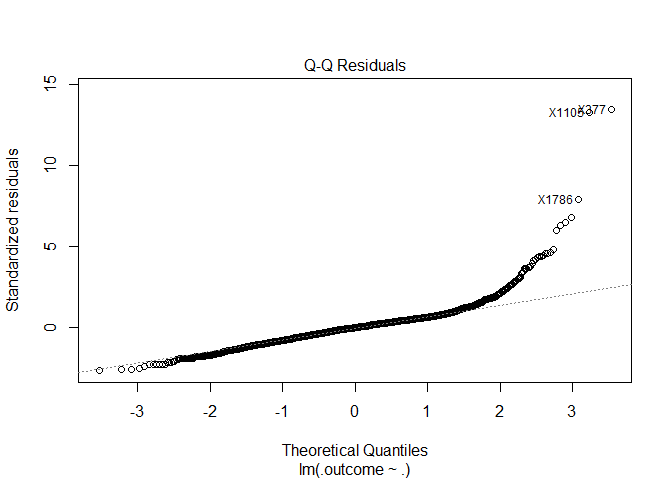
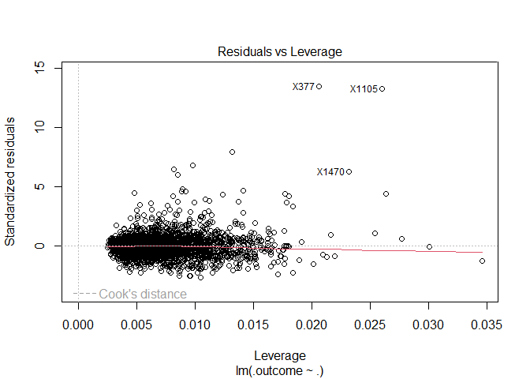

analysis_XinyiShang_xs2529
================
Xinyi Shang
2024-03-20

``` r
# read RData file
df_recov <- get(load("./data/recovery.RData")) |> 
  janitor::clean_names()

summary(df_recov)
```

    ##        id              age           gender       race     smoking 
    ##  Min.   :   1.0   Min.   :42.0   Min.   :0.0000   1:1967   0:1822  
    ##  1st Qu.: 750.8   1st Qu.:57.0   1st Qu.:0.0000   2: 158   1: 859  
    ##  Median :1500.5   Median :60.0   Median :0.0000   3: 604   2: 319  
    ##  Mean   :1500.5   Mean   :60.2   Mean   :0.4853   4: 271           
    ##  3rd Qu.:2250.2   3rd Qu.:63.0   3rd Qu.:1.0000                    
    ##  Max.   :3000.0   Max.   :79.0   Max.   :1.0000                    
    ##      height          weight            bmi         hypertension   
    ##  Min.   :147.8   Min.   : 55.90   Min.   :18.80   Min.   :0.0000  
    ##  1st Qu.:166.0   1st Qu.: 75.20   1st Qu.:25.80   1st Qu.:0.0000  
    ##  Median :169.9   Median : 79.80   Median :27.65   Median :0.0000  
    ##  Mean   :169.9   Mean   : 79.96   Mean   :27.76   Mean   :0.4973  
    ##  3rd Qu.:173.9   3rd Qu.: 84.80   3rd Qu.:29.50   3rd Qu.:1.0000  
    ##  Max.   :188.6   Max.   :103.70   Max.   :38.90   Max.   :1.0000  
    ##     diabetes           sbp             ldl           vaccine     
    ##  Min.   :0.0000   Min.   :105.0   Min.   : 28.0   Min.   :0.000  
    ##  1st Qu.:0.0000   1st Qu.:125.0   1st Qu.: 97.0   1st Qu.:0.000  
    ##  Median :0.0000   Median :130.0   Median :110.0   Median :1.000  
    ##  Mean   :0.1543   Mean   :130.5   Mean   :110.5   Mean   :0.596  
    ##  3rd Qu.:0.0000   3rd Qu.:136.0   3rd Qu.:124.0   3rd Qu.:1.000  
    ##  Max.   :1.0000   Max.   :156.0   Max.   :178.0   Max.   :1.000  
    ##     severity        study           recovery_time   
    ##  Min.   :0.000   Length:3000        Min.   :  2.00  
    ##  1st Qu.:0.000   Class :character   1st Qu.: 31.00  
    ##  Median :0.000   Mode  :character   Median : 39.00  
    ##  Mean   :0.107                      Mean   : 42.17  
    ##  3rd Qu.:0.000                      3rd Qu.: 49.00  
    ##  Max.   :1.000                      Max.   :365.00

``` r
set.seed(2024)

data_split = initial_split(df_recov, prop = .80)
train = training(data_split) |>
  select( -id)
test = testing(data_split) |>
  select( -id)

# Training data
x = model.matrix(recovery_time~.,train)[, -1]
y = train$recovery_time

# Testing data
x2 <- model.matrix(recovery_time~.,test)[, -1]
y2 <- test$recovery_time

ctrl1 <- trainControl(method = "cv", number = 10, allowParallel = TRUE)
```

``` r
#calculate rmse
calculate_rmse <- function(model, x2, y2) {
  test_pred <- predict(model, newdata = x2)
  test_rmse <- sqrt(mean((test_pred - y2) ^ 2))
  
  return(test_rmse)
}
```

**Linear Model**

``` r
set.seed(2024)

lm <- train(x, y, method = "lm", trControl = ctrl1)

summary(lm)
```

    ## 
    ## Call:
    ## lm(formula = .outcome ~ ., data = dat)
    ## 
    ## Residuals:
    ##     Min      1Q  Median      3Q     Max 
    ## -53.037 -10.712  -0.508   8.268 263.578 
    ## 
    ## Coefficients:
    ##                Estimate Std. Error t value Pr(>|t|)    
    ## (Intercept)  -1.893e+03  1.155e+02 -16.381  < 2e-16 ***
    ## age           3.024e-01  1.023e-01   2.955 0.003153 ** 
    ## gender       -2.988e+00  8.089e-01  -3.694 0.000226 ***
    ## race2         3.388e+00  1.822e+00   1.859 0.063138 .  
    ## race3        -6.868e-01  1.027e+00  -0.669 0.503720    
    ## race4        -1.427e+00  1.472e+00  -0.969 0.332428    
    ## smoking1      1.749e+00  9.148e-01   1.912 0.055966 .  
    ## smoking2      3.533e+00  1.344e+00   2.628 0.008635 ** 
    ## height        1.102e+01  6.773e-01  16.276  < 2e-16 ***
    ## weight       -1.193e+01  7.152e-01 -16.680  < 2e-16 ***
    ## bmi           3.608e+01  2.054e+00  17.568  < 2e-16 ***
    ## hypertension  2.690e+00  1.325e+00   2.030 0.042449 *  
    ## diabetes     -1.670e+00  1.133e+00  -1.474 0.140535    
    ## sbp          -6.707e-04  8.631e-02  -0.008 0.993800    
    ## ldl          -2.969e-02  2.132e-02  -1.393 0.163882    
    ## vaccine      -6.301e+00  8.250e-01  -7.638 3.18e-14 ***
    ## severity      5.917e+00  1.301e+00   4.549 5.67e-06 ***
    ## studyB        5.057e+00  8.613e-01   5.871 4.94e-09 ***
    ## ---
    ## Signif. codes:  0 '***' 0.001 '**' 0.01 '*' 0.05 '.' 0.1 ' ' 1
    ## 
    ## Residual standard error: 19.77 on 2382 degrees of freedom
    ## Multiple R-squared:  0.2256, Adjusted R-squared:   0.22 
    ## F-statistic: 40.81 on 17 and 2382 DF,  p-value: < 2.2e-16

``` r
plot(lm$finalModel)
```

<!-- --><!-- --><!-- --><!-- -->

``` r
rmse_value <- calculate_rmse(lm, x2, y2)
print(rmse_value)
```

    ## [1] 21.70729

**LASSO**

``` r
# Set seed for reproducibility
set.seed(2024)

# Train LASSO Model
lasso <- train(x,y,
               data = train,
               method = "glmnet",
               tuneGrid = expand.grid(alpha = 1, lambda = exp(seq(10, -10, length = 100))),
               trControl = ctrl1)

# Extract Coefficients at best lambda
coef(lasso$finalModel, s = lasso$bestTune$lambda)
```

    ## 18 x 1 sparse Matrix of class "dgCMatrix"
    ##                         s1
    ## (Intercept)  -1.790521e+03
    ## age           3.031259e-01
    ## gender       -2.972898e+00
    ## race2         3.383030e+00
    ## race3        -6.665110e-01
    ## race4        -1.425064e+00
    ## smoking1      1.720400e+00
    ## smoking2      3.469800e+00
    ## height        1.042066e+01
    ## weight       -1.129058e+01
    ## bmi           3.424726e+01
    ## hypertension  2.675975e+00
    ## diabetes     -1.670727e+00
    ## sbp           .           
    ## ldl          -2.917502e-02
    ## vaccine      -6.297548e+00
    ## severity      5.877773e+00
    ## studyB        5.043660e+00

``` r
# View best tuning parameters
lasso$bestTune
```

    ##    alpha      lambda
    ## 26     1 0.007086987

``` r
# Plot model
plot(lasso, xTrans = log)
```

<!-- -->

``` r
# Calculate and print RMSE
rmse_value <- calculate_rmse(lasso, x2, y2)
print(rmse_value)
```

    ## [1] 21.80099

**Ridge**

``` r
# Set seed for reproducibility
set.seed(2024)

# Train ridge Model
ridge <- train(x,y,
               data = train,
               method = "glmnet",
               tuneGrid = expand.grid(alpha = 0, lambda = exp(seq(10, -10, length = 100))),
               trControl = ctrl1)

# Extract Coefficients at best lambda
coef(ridge$finalModel, s = ridge$bestTune$lambda)
```

    ## 18 x 1 sparse Matrix of class "dgCMatrix"
    ##                         s1
    ## (Intercept)  -88.793877369
    ## age            0.337716864
    ## gender        -2.887487626
    ## race2          3.653136318
    ## race3         -0.670122648
    ## race4         -1.893301307
    ## smoking1       1.533851174
    ## smoking2       2.852821090
    ## height         0.388447289
    ## weight        -0.672787548
    ## bmi            3.714325264
    ## hypertension   2.787728002
    ## diabetes      -1.968811271
    ## sbp           -0.004322627
    ## ldl           -0.028329531
    ## vaccine       -6.350093251
    ## severity       5.448595072
    ## studyB         4.965623471

``` r
# View best tuning parameters
ridge$bestTune
```

    ##    alpha    lambda
    ## 47     0 0.4930865

``` r
# Plot model
plot(ridge, xTrans = log)
```

<!-- -->

``` r
# Calculate and print RMSE
rmse_value <- calculate_rmse(ridge, x2, y2)
print(rmse_value)
```

    ## [1] 24.17942

**Elastic Net**

``` r
# Set seed for reproducibility
set.seed(2024)

# Train ridge Model
elastic <- train(x,y,
               data = train,
               method = "glmnet",
               tuneGrid = expand.grid(alpha = seq(0, 1, length = 11), lambda = exp(seq(10, -10, length = 100))),
               trControl = ctrl1)

# Extract Coefficients at best lambda
coef(elastic$finalModel, s = elastic$bestTune$lambda)
```

    ## 18 x 1 sparse Matrix of class "dgCMatrix"
    ##                         s1
    ## (Intercept)  -1.766894e+03
    ## age           3.053938e-01
    ## gender       -2.984641e+00
    ## race2         3.408692e+00
    ## race3        -6.853500e-01
    ## race4        -1.461900e+00
    ## smoking1      1.735947e+00
    ## smoking2      3.490366e+00
    ## height        1.028197e+01
    ## weight       -1.114365e+01
    ## bmi           3.382487e+01
    ## hypertension  2.705315e+00
    ## diabetes     -1.692554e+00
    ## sbp          -1.320360e-03
    ## ldl          -2.965762e-02
    ## vaccine      -6.314159e+00
    ## severity      5.891719e+00
    ## studyB        5.057971e+00

``` r
# View best tuning parameters
elastic$bestTune
```

    ##     alpha      lambda
    ## 221   0.2 0.002580955

``` r
# Plot model
plot(elastic, xTrans = log)
```

<!-- -->

``` r
# Calculate and print RMSE
rmse_value <- calculate_rmse(elastic, x2, y2)
print(rmse_value)
```

    ## [1] 21.82362

**PCR**

``` r
set.seed(2024)
pcr <- train(
  x, y,
  method = "pcr",
  tuneGrid = data.frame(ncomp = 1:17),
  trControl = ctrl1,
  preProcess = c("center", "scale")
)

summary(pcr)
```

    ## Data:    X dimension: 2400 17 
    ##  Y dimension: 2400 1
    ## Fit method: svdpc
    ## Number of components considered: 17
    ## TRAINING: % variance explained
    ##           1 comps  2 comps  3 comps  4 comps  5 comps  6 comps  7 comps
    ## X          13.044   23.588   30.950   38.218   44.993   51.449   57.615
    ## .outcome    0.821    7.332    7.472    8.722    8.732    9.093    9.273
    ##           8 comps  9 comps  10 comps  11 comps  12 comps  13 comps  14 comps
    ## X          63.613    69.53     75.26     80.78     85.84     90.45     94.78
    ## .outcome    9.839    11.44     12.24     12.29     12.71     12.78     12.98
    ##           15 comps  16 comps  17 comps
    ## X            98.80     99.99    100.00
    ## .outcome     13.09     13.16     22.56

``` r
ggplot(pcr) 
```

<!-- -->

``` r
# Calculate and print RMSE
rmse_value <- calculate_rmse(pcr, x2, y2)
print(rmse_value)
```

    ## [1] 21.70729

**PLS**

``` r
set.seed(2024)

pls <- train(
  x, y,
  method = "pls",
  tuneGrid = data.frame(ncomp = 1:17),
  trControl = ctrl1,
  preProcess = c("center", "scale")
)

summary(pls)
```

    ## Data:    X dimension: 2400 17 
    ##  Y dimension: 2400 1
    ## Fit method: oscorespls
    ## Number of components considered: 12
    ## TRAINING: % variance explained
    ##           1 comps  2 comps  3 comps  4 comps  5 comps  6 comps  7 comps
    ## X           10.01    18.15    28.73    34.35    37.88    42.14    44.93
    ## .outcome    12.16    13.12    13.21    13.36    13.85    14.53    18.77
    ##           8 comps  9 comps  10 comps  11 comps  12 comps
    ## X           47.96    53.46     59.15     65.10     70.87
    ## .outcome    22.40    22.55     22.56     22.56     22.56

``` r
ggplot(pls) 
```

<!-- -->

``` r
# Calculate and print RMSE
rmse_value <- calculate_rmse(pls, x2, y2)
print(rmse_value)
```

    ## [1] 21.70728

**MARS**

``` r
set.seed(2024)

mars <- train(
  x, y,
  method = "earth",
  tuneGrid = expand.grid(degree = 1:5, nprune = seq(2, 30)),
  metric = "RMSE",
  trControl = ctrl1
)

summary(mars$finalModel)
```

    ## Call: earth(x=matrix[2400,17], y=c(33,44,33,27,6...), keepxy=TRUE, degree=4,
    ##             nprune=7)
    ## 
    ##                                       coefficients
    ## (Intercept)                              22.435204
    ## vaccine                                  -6.264022
    ## h(bmi-25.7)                               4.898496
    ## h(30.3-bmi)                               3.574364
    ## h(bmi-30.3) * studyB                      9.782606
    ## h(164-height) * h(bmi-30.3) * studyB      2.990502
    ## h(87.6-weight) * h(bmi-30.3) * studyB    -2.640353
    ## 
    ## Selected 7 of 22 terms, and 5 of 17 predictors (nprune=7)
    ## Termination condition: Reached nk 35
    ## Importance: bmi, studyB, height, weight, vaccine, age-unused, ...
    ## Number of terms at each degree of interaction: 1 3 1 2
    ## GCV 305.1695    RSS 722673.9    GRSq 0.3915679    RSq 0.3991527

``` r
mars$bestTune
```

    ##    nprune degree
    ## 93      7      4

``` r
plot(mars)
```

<!-- -->

``` r
vip(mars$finalModel, type = "nsubsets")
```

<!-- -->

``` r
rmse_value <- calculate_rmse(mars, x2, y2)
print(rmse_value)
```

    ## [1] 17.63574

**GAM**

``` r
set.seed(2024)
gam = train(x, y,
            method = "gam",   
            tuneGrid = data.frame(method = "GCV.Cp",
                                  select = c(TRUE, FALSE)),
            trControl = ctrl1)

summary(gam$finalModel)
```

    ## 
    ## Family: gaussian 
    ## Link function: identity 
    ## 
    ## Formula:
    ## .outcome ~ gender + race2 + race3 + race4 + smoking1 + smoking2 + 
    ##     hypertension + diabetes + vaccine + severity + studyB + s(age) + 
    ##     s(sbp) + s(ldl) + s(bmi) + s(height) + s(weight)
    ## 
    ## Parametric coefficients:
    ##              Estimate Std. Error t value Pr(>|t|)    
    ## (Intercept)   43.1568     1.0646  40.540  < 2e-16 ***
    ## gender        -3.3920     0.7687  -4.413 1.07e-05 ***
    ## race2          2.5889     1.7284   1.498  0.13431    
    ## race3         -0.5280     0.9743  -0.542  0.58789    
    ## race4         -1.2561     1.3982  -0.898  0.36906    
    ## smoking1       1.9909     0.8684   2.293  0.02195 *  
    ## smoking2       4.1584     1.2778   3.254  0.00115 ** 
    ## hypertension   2.7655     1.2687   2.180  0.02937 *  
    ## diabetes      -1.4274     1.0750  -1.328  0.18433    
    ## vaccine       -6.3431     0.7834  -8.097 8.88e-16 ***
    ## severity       5.9477     1.2351   4.816 1.56e-06 ***
    ## studyB         4.6537     0.8190   5.682 1.50e-08 ***
    ## ---
    ## Signif. codes:  0 '***' 0.001 '**' 0.01 '*' 0.05 '.' 0.1 ' ' 1
    ## 
    ## Approximate significance of smooth terms:
    ##             edf Ref.df      F p-value    
    ## s(age)    1.000  1.000  6.114 0.01348 *  
    ## s(sbp)    1.196  1.367  0.093 0.91631    
    ## s(ldl)    1.000  1.000  1.617 0.20368    
    ## s(bmi)    8.607  8.945 63.287 < 2e-16 ***
    ## s(height) 1.000  1.000  5.495 0.01915 *  
    ## s(weight) 2.750  3.732  4.360 0.00163 ** 
    ## ---
    ## Signif. codes:  0 '***' 0.001 '**' 0.01 '*' 0.05 '.' 0.1 ' ' 1
    ## 
    ## R-sq.(adj) =    0.3   Deviance explained = 30.8%
    ## GCV =    355  Scale est. = 350.93    n = 2400

``` r
gam$bestTune
```

    ##   select method
    ## 1  FALSE GCV.Cp

``` r
plot(gam)
```

<!-- -->

``` r
rmse_value <- calculate_rmse(gam, x2, y2)
print(rmse_value)
```

    ## [1] 20.66657

## Model Comparison

``` r
resamp <- resamples(list(
  lm = lm,
  lasso = lasso,
  ridge = ridge,
  elastic_net = elastic,
  pcr = pcr,
  pls = pls,
  mars = mars,
  gam = gam
))

summary(resamp)
```

    ## 
    ## Call:
    ## summary.resamples(object = resamp)
    ## 
    ## Models: lm, lasso, ridge, elastic_net, pcr, pls, mars, gam 
    ## Number of resamples: 10 
    ## 
    ## MAE 
    ##                 Min.  1st Qu.   Median     Mean  3rd Qu.     Max. NA's
    ## lm          11.74160 12.57542 13.05304 12.96649 13.35735 14.01804    0
    ## lasso       11.69128 12.48331 12.99886 12.91538 13.30087 13.96551    0
    ## ridge       11.61061 12.89322 13.00231 13.07056 13.44631 14.29571    0
    ## elastic_net 11.68282 12.45336 12.99454 12.90670 13.28674 13.95750    0
    ## pcr         11.74160 12.57542 13.05304 12.96649 13.35735 14.01804    0
    ## pls         11.74160 12.57540 13.05304 12.96648 13.35735 14.01805    0
    ## mars        11.29074 11.69608 12.07834 12.06412 12.47637 12.82283    0
    ## gam         11.18041 12.14532 12.58068 12.46836 12.96641 13.51204    0
    ## 
    ## RMSE 
    ##                 Min.  1st Qu.   Median     Mean  3rd Qu.     Max. NA's
    ## lm          16.73131 17.89516 19.21757 19.71575 20.50813 24.32138    0
    ## lasso       16.59774 17.90466 19.18214 19.71227 20.52274 24.38778    0
    ## ridge       15.36616 19.20411 19.54329 20.58662 21.68757 26.05950    0
    ## elastic_net 16.55123 17.90904 19.17357 19.70996 20.52724 24.39890    0
    ## pcr         16.73131 17.89516 19.21757 19.71575 20.50813 24.32138    0
    ## pls         16.73129 17.89516 19.21756 19.71574 20.50813 24.32139    0
    ## mars        15.54017 17.99626 18.18269 18.62498 18.97357 22.31588    0
    ## gam         15.93861 16.89042 18.91441 18.98713 20.21679 22.83180    0
    ## 
    ## Rsquared 
    ##                   Min.   1st Qu.    Median      Mean   3rd Qu.      Max. NA's
    ## lm          0.06611697 0.2019001 0.2268777 0.2122074 0.2473751 0.2819362    0
    ## lasso       0.07031081 0.2001718 0.2271935 0.2118104 0.2465712 0.2797609    0
    ## ridge       0.09486261 0.1145127 0.1348116 0.1368990 0.1477628 0.2011960    0
    ## elastic_net 0.07213534 0.1996883 0.2272942 0.2117228 0.2461907 0.2791796    0
    ## pcr         0.06611697 0.2019001 0.2268777 0.2122074 0.2473751 0.2819362    0
    ## pls         0.06611802 0.2019003 0.2268774 0.2122076 0.2473758 0.2819355    0
    ## mars        0.02635744 0.1884568 0.2863402 0.2986044 0.3884283 0.6892535    0
    ## gam         0.09606751 0.2020966 0.2670992 0.2781279 0.3666627 0.4376890    0

``` r
bwplot(resamp, metric = "RMSE")
```

<!-- -->
**Model Evaluation**

``` r
best_model = mars$finalModel

plot(best_model)
```

<!-- -->
