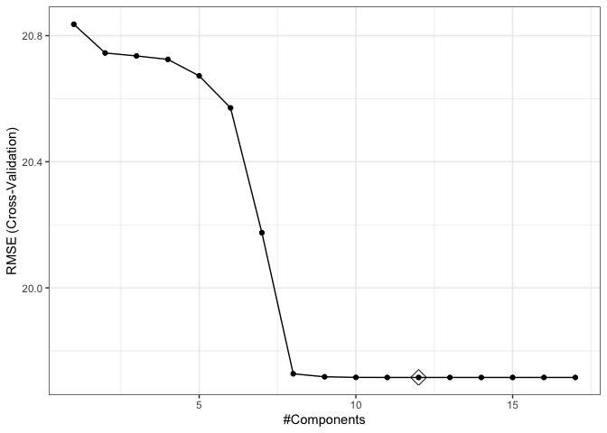
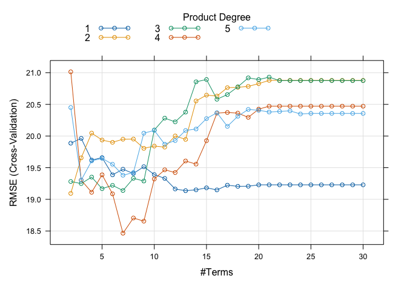

Midterm Project
================
Yuki Joyama
2024-03-19

``` r
# read RData file
df_recov <- get(load("./data/recovery.RData")) |> 
  janitor::clean_names()

head(df_recov)
```

    ##   id age gender race smoking height weight  bmi hypertension diabetes sbp ldl
    ## 1  1  56      0    1       2  170.2   78.7 27.2            0        0 120  97
    ## 2  2  70      1    1       1  169.6   73.1 25.4            1        0 134 112
    ## 3  3  57      1    1       0  168.4   77.4 27.3            1        0 131  88
    ## 4  4  53      0    1       0  166.7   76.1 27.4            0        0 115  87
    ## 5  5  59      1    1       2  173.6   70.2 23.3            0        0 127 118
    ## 6  6  60      1    3       1  162.8   75.1 28.4            0        0 129 104
    ##   vaccine severity study recovery_time
    ## 1       0        0     A            31
    ## 2       0        0     A            44
    ## 3       1        0     A            29
    ## 4       0        1     A            47
    ## 5       1        0     A            40
    ## 6       0        0     A            34

``` r
# partition (training:test=80:20)
set.seed(2024)
data_split = initial_split(df_recov, prop = .80)
# training data
df_train = training(data_split) |> 
  select(!id)
# test data
df_test = testing(data_split) |> 
  select(!id)

# set up 10-fold CV
ctrl1 <- trainControl(
  method = "repeatedcv",
  number = 10,
  repeats = 5,
  selectionFunction = "best"
)
```

# Model training

## Linear model

``` r
set.seed(2024)

lm.fit <- train(
  recovery_time ~ .,
  data = df_train,
  method = "lm",
  metric = "RMSE",
  trControl = ctrl1
)

# check the model
summary(lm.fit$finalModel)
```

    ## 
    ## Call:
    ## lm(formula = .outcome ~ ., data = dat)
    ## 
    ## Residuals:
    ##     Min      1Q  Median      3Q     Max 
    ## -53.037 -10.712  -0.508   8.268 263.578 
    ## 
    ## Coefficients:
    ##                Estimate Std. Error t value Pr(>|t|)    
    ## (Intercept)  -1.893e+03  1.155e+02 -16.381  < 2e-16 ***
    ## age           3.024e-01  1.023e-01   2.955 0.003153 ** 
    ## gender       -2.988e+00  8.089e-01  -3.694 0.000226 ***
    ## race2         3.388e+00  1.822e+00   1.859 0.063138 .  
    ## race3        -6.868e-01  1.027e+00  -0.669 0.503720    
    ## race4        -1.427e+00  1.472e+00  -0.969 0.332428    
    ## smoking1      1.749e+00  9.148e-01   1.912 0.055966 .  
    ## smoking2      3.533e+00  1.344e+00   2.628 0.008635 ** 
    ## height        1.102e+01  6.773e-01  16.276  < 2e-16 ***
    ## weight       -1.193e+01  7.152e-01 -16.680  < 2e-16 ***
    ## bmi           3.608e+01  2.054e+00  17.568  < 2e-16 ***
    ## hypertension  2.690e+00  1.325e+00   2.030 0.042449 *  
    ## diabetes     -1.670e+00  1.133e+00  -1.474 0.140535    
    ## sbp          -6.707e-04  8.631e-02  -0.008 0.993800    
    ## ldl          -2.969e-02  2.132e-02  -1.393 0.163882    
    ## vaccine      -6.301e+00  8.250e-01  -7.638 3.18e-14 ***
    ## severity      5.917e+00  1.301e+00   4.549 5.67e-06 ***
    ## studyB        5.057e+00  8.613e-01   5.871 4.94e-09 ***
    ## ---
    ## Signif. codes:  0 '***' 0.001 '**' 0.01 '*' 0.05 '.' 0.1 ' ' 1
    ## 
    ## Residual standard error: 19.77 on 2382 degrees of freedom
    ## Multiple R-squared:  0.2256, Adjusted R-squared:   0.22 
    ## F-statistic: 40.81 on 17 and 2382 DF,  p-value: < 2.2e-16

``` r
# obtain the test error
lm.pred <- predict(lm.fit, newdata = df_test)
mean((lm.pred - pull(df_test, "recovery_time"))^2) 
```

    ## [1] 471.2063

## Lasso

``` r
set.seed(2024)

# find tuning parameter by CV
lasso.fit <- 
  train(
    recovery_time ~ .,
    data = df_train,
    method = "glmnet",
    tuneGrid = expand.grid(
      alpha = 1,
      lambda = exp(seq(2, 0, length = 100))
    ),
    trControl = ctrl1
  )

coef(lasso.fit$finalModel, s = lasso.fit$bestTune$lambda) 
```

    ## 18 x 1 sparse Matrix of class "dgCMatrix"
    ##                       s1
    ## (Intercept)   0.58101393
    ## age           0.17689011
    ## gender       -1.06968284
    ## race2         0.03895677
    ## race3         .         
    ## race4         .         
    ## smoking1      .         
    ## smoking2      .         
    ## height       -0.08826999
    ## weight        .         
    ## bmi           1.69963529
    ## hypertension  1.05726539
    ## diabetes      .         
    ## sbp           .         
    ## ldl           .         
    ## vaccine      -4.53664519
    ## severity      2.68330967
    ## studyB        2.86278627

``` r
# plot RMSE and lambda
plot(lasso.fit, xTrans = log)
```

<!-- -->

``` r
# print the best tuning parameter
lasso.fit$bestTune
```

    ##   alpha lambda
    ## 1     1      1

``` r
# obtain the test error
lasso.pred <- predict(lasso.fit, newdata = df_test)
mean((lasso.pred - pull(df_test, "recovery_time"))^2) 
```

    ## [1] 608.0764

## Ridge

``` r
set.seed(2024)

# find tuning parameter by CV
ridge.fit <- 
  train(
    recovery_time ~ .,
    data = df_train,
    method = "glmnet",
    tuneGrid = expand.grid(
      alpha = 0,
      lambda = exp(seq(2, 0, length = 100))
    ),
    trControl = ctrl1
  )

coef(ridge.fit$finalModel, s = ridge.fit$bestTune$lambda) 
```

    ## 18 x 1 sparse Matrix of class "dgCMatrix"
    ##                        s1
    ## (Intercept)  -36.94667718
    ## age            0.33268421
    ## gender        -2.84119812
    ## race2          3.61743614
    ## race3         -0.65708318
    ## race4         -1.86496539
    ## smoking1       1.49752762
    ## smoking2       2.76787312
    ## height         0.08219790
    ## weight        -0.34473050
    ## bmi            2.75645895
    ## hypertension   2.68086108
    ## diabetes      -1.94769945
    ## sbp            0.00158031
    ## ldl           -0.02740337
    ## vaccine       -6.25107058
    ## severity       5.35496926
    ## studyB         4.88214929

``` r
# plot RMSE and lambda
plot(ridge.fit, xTrans = log)
```

<!-- -->

``` r
# print the best tuning parameter
ridge.fit$bestTune
```

    ##   alpha lambda
    ## 1     0      1

``` r
# obtain the test error
ridge.pred <- predict(ridge.fit, newdata = df_test)
mean((ridge.pred - pull(df_test, "recovery_time"))^2) 
```

    ## [1] 589.3664

## Elastic net

``` r
set.seed(2024)

# find tuning parameter by CV
enet.fit <- 
  train(
    recovery_time ~ .,
    data = df_train,
    method = "glmnet",
    tuneGrid = expand.grid(
      alpha = seq(0, 1, length = 20),
      lambda = exp(seq(2, 0, length = 100))
    ),
    trControl = ctrl1
  )

# check the best tuning parameter
enet.fit$bestTune
```

    ##   alpha lambda
    ## 1     0      1

``` r
# plot RMSE, lambda and alpha
myCol <- rainbow(25)
myPar <- list(
  superpose.symbol = list(col = myCol),
  superpose.line = list(col = myCol)
)

plot(enet.fit, par.settings = myPar, xTrans = log)
```

<!-- -->

``` r
# coefficients in the final model
coef(enet.fit$finalModel, s = enet.fit$bestTune$lambda)
```

    ## 18 x 1 sparse Matrix of class "dgCMatrix"
    ##                        s1
    ## (Intercept)  -36.94667718
    ## age            0.33268421
    ## gender        -2.84119812
    ## race2          3.61743614
    ## race3         -0.65708318
    ## race4         -1.86496539
    ## smoking1       1.49752762
    ## smoking2       2.76787312
    ## height         0.08219790
    ## weight        -0.34473050
    ## bmi            2.75645895
    ## hypertension   2.68086108
    ## diabetes      -1.94769945
    ## sbp            0.00158031
    ## ldl           -0.02740337
    ## vaccine       -6.25107058
    ## severity       5.35496926
    ## studyB         4.88214929

``` r
# obtain predicted values
enet.pred <- predict(enet.fit, newdata = df_test)
# test error
mean((enet.pred - pull(df_test, "recovery_time"))^2)
```

    ## [1] 589.3664

## Principal Components Regression model (PCR)

``` r
# prepare x and y
# training 
x <- model.matrix(recovery_time ~ ., data = df_train)[, -1]
y <- df_train$recovery_time

# test
x2 <- model.matrix(recovery_time ~ ., df_test)[, -1]
y2 <- df_test$recovery_time

set.seed(2024)

pcr.fit <- train(
  x, y,
  method = "pcr",
  tuneGrid = data.frame(ncomp = 1:18),
  trControl = ctrl1,
  preProcess = c("center", "scale")
)

summary(pcr.fit)
```

    ## Data:    X dimension: 2400 17 
    ##  Y dimension: 2400 1
    ## Fit method: svdpc
    ## Number of components considered: 17
    ## TRAINING: % variance explained
    ##           1 comps  2 comps  3 comps  4 comps  5 comps  6 comps  7 comps
    ## X          13.044   23.588   30.950   38.218   44.993   51.449   57.615
    ## .outcome    0.821    7.332    7.472    8.722    8.732    9.093    9.273
    ##           8 comps  9 comps  10 comps  11 comps  12 comps  13 comps  14 comps
    ## X          63.613    69.53     75.26     80.78     85.84     90.45     94.78
    ## .outcome    9.839    11.44     12.24     12.29     12.71     12.78     12.98
    ##           15 comps  16 comps  17 comps
    ## X            98.80     99.99    100.00
    ## .outcome     13.09     13.16     22.56

``` r
# obtain predicted values 
pred.pcr <- predict(
  pcr.fit, 
  newdata = x2
)

# visualize RMSE and the number of components
ggplot(pcr.fit, highlight = T) 
```

<!-- -->

``` r
# test MSE
mean((pred.pcr - y2)^2)
```

    ## [1] 471.2063

## Partial Least Squares model (PLS)

``` r
set.seed(2024)

pls.fit <- train(
  x, y,
  method = "pls",
  tuneGrid = data.frame(ncomp = 1:18),
  trControl = ctrl1,
  preProcess = c("center", "scale")
)

summary(pls.fit)
```

    ## Data:    X dimension: 2400 17 
    ##  Y dimension: 2400 1
    ## Fit method: oscorespls
    ## Number of components considered: 11
    ## TRAINING: % variance explained
    ##           1 comps  2 comps  3 comps  4 comps  5 comps  6 comps  7 comps
    ## X           10.01    18.15    28.73    34.35    37.88    42.14    44.93
    ## .outcome    12.16    13.12    13.21    13.36    13.85    14.53    18.77
    ##           8 comps  9 comps  10 comps  11 comps
    ## X           47.96    53.46     59.15     65.10
    ## .outcome    22.40    22.55     22.56     22.56

``` r
# obtain predicted values 
pred.pls <- predict(
  pls.fit, 
  newdata = x2
)

# visualize RMSE and the number of components
ggplot(pls.fit, highlight = T) 
```

<!-- -->

``` r
# test MSE
mean((pred.pls - y2)^2)
```

    ## [1] 471.1963

## MARS

``` r
set.seed(2024)

# fit mars model
mars.fit <- train(
  x = df_train[1:14],
  y = df_train$recovery_time,
  method = "earth",
  tuneGrid = expand.grid(degree = 1:5, nprune = 2:30),
  metric = "RMSE",
  trControl = ctrl1
)

summary(mars.fit$finalModel)
```

    ## Call: earth(x=data.frame[2400,14], y=c(33,44,33,27,6...), keepxy=TRUE,
    ##             degree=1, nprune=13)
    ## 
    ##                 coefficients
    ## (Intercept)         7.389076
    ## gender             -3.382257
    ## hypertension        3.359153
    ## vaccine            -6.322448
    ## severity            6.023281
    ## studyB              4.362768
    ## h(height-158.4)     1.101916
    ## h(88.9-weight)      1.144898
    ## h(weight-88.9)     -2.297625
    ## h(bmi-25.7)         4.499418
    ## h(bmi-30.3)         9.950899
    ## h(bmi-33.2)       -38.658265
    ## h(bmi-34)          66.317925
    ## 
    ## Selected 13 of 22 terms, and 8 of 17 predictors (nprune=13)
    ## Termination condition: Reached nk 35
    ## Importance: bmi, vaccine, studyB, severity, weight, height, gender, ...
    ## Number of terms at each degree of interaction: 1 12 (additive model)
    ## GCV 352.8781    RSS 829355.5    GRSq 0.2964487    RSq 0.3104552

``` r
# best tuning parameters
mars.fit$bestTune
```

    ##    nprune degree
    ## 12     13      1

``` r
# plot
plot(mars.fit)
```

<!-- -->

``` r
# relative variable importance
vip(mars.fit$finalModel, type = "nsubsets")
```

<!-- -->

``` r
# obtain the test error
mars.pred <- predict(mars.fit, newdata = df_test)
mean((mars.pred - pull(df_test, "recovery_time"))^2) 
```

    ## [1] 422.1784

## Model Comparison

``` r
# resampling 
resamp <- resamples(list(
  lm = lm.fit,
  lasso = lasso.fit,
  ridge = ridge.fit,
  elastic_net = enet.fit,
  pcr = pcr.fit,
  pls = pls.fit,
  mars = mars.fit
))

summary(resamp)
```

    ## 
    ## Call:
    ## summary.resamples(object = resamp)
    ## 
    ## Models: lm, lasso, ridge, elastic_net, pcr, pls, mars 
    ## Number of resamples: 50 
    ## 
    ## MAE 
    ##                 Min.  1st Qu.   Median     Mean  3rd Qu.     Max. NA's
    ## lm          11.74160 12.49780 12.87502 12.97722 13.45592 14.97208    0
    ## lasso       11.47695 12.42761 12.91792 13.00355 13.47940 14.37897    0
    ## ridge       11.62019 12.55537 12.96290 13.11441 13.61582 14.67843    0
    ## elastic_net 11.62019 12.55537 12.96290 13.11441 13.61582 14.67843    0
    ## pcr         11.74160 12.49780 12.87502 12.97722 13.45592 14.97208    0
    ## pls         11.74153 12.49777 12.87491 12.97718 13.45593 14.97204    0
    ## mars        11.07337 11.97671 12.53372 12.52419 13.07886 14.03005    0
    ## 
    ## RMSE 
    ##                 Min.  1st Qu.   Median     Mean  3rd Qu.     Max. NA's
    ## lm          15.47489 17.30781 18.66710 19.68814 20.85903 29.12836    0
    ## lasso       15.19120 17.92370 19.91830 20.82733 22.13757 32.42313    0
    ## ridge       15.36332 17.82198 19.72293 20.63005 21.86869 31.73377    0
    ## elastic_net 15.36332 17.82198 19.72293 20.63005 21.86869 31.73377    0
    ## pcr         15.47489 17.30781 18.66710 19.68814 20.85903 29.12836    0
    ## pls         15.47433 17.30754 18.66679 19.68812 20.85922 29.12867    0
    ## mars        14.69598 16.84460 18.59102 19.04707 20.79798 27.20576    0
    ## 
    ## Rsquared 
    ##                   Min.    1st Qu.    Median      Mean   3rd Qu.      Max. NA's
    ## lm          0.06611697 0.17365546 0.2076818 0.2138144 0.2452558 0.3778304    0
    ## lasso       0.03150644 0.07989604 0.1078604 0.1181922 0.1493147 0.2597958    0
    ## ridge       0.04922844 0.09702647 0.1255336 0.1317595 0.1643056 0.2736369    0
    ## elastic_net 0.04922844 0.09702647 0.1255336 0.1317595 0.1643056 0.2736369    0
    ## pcr         0.06611697 0.17365546 0.2076818 0.2138144 0.2452558 0.3778304    0
    ## pls         0.06609999 0.17366081 0.2076837 0.2138159 0.2452710 0.3777927    0
    ## mars        0.08969724 0.19744343 0.2565861 0.2746779 0.3436831 0.5103574    0

``` r
# visualize RMSEs 
bwplot(resamp, metric = "RMSE")
```

<!-- -->
