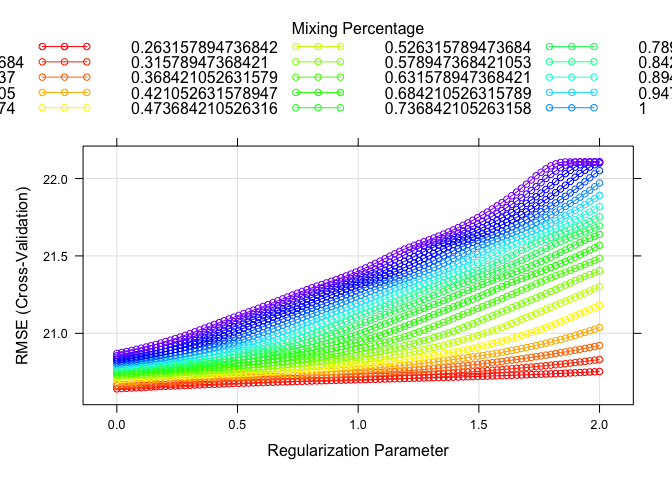
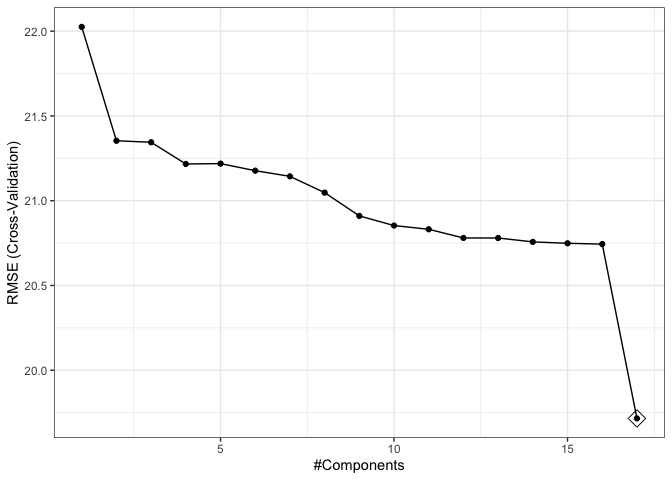

Midterm Project
================
Yuki Joyama
2024-03-19

    ##   id age gender race smoking height weight  bmi hypertension diabetes sbp ldl
    ## 1  1  56      0    1       2  170.2   78.7 27.2            0        0 120  97
    ## 2  2  70      1    1       1  169.6   73.1 25.4            1        0 134 112
    ## 3  3  57      1    1       0  168.4   77.4 27.3            1        0 131  88
    ## 4  4  53      0    1       0  166.7   76.1 27.4            0        0 115  87
    ## 5  5  59      1    1       2  173.6   70.2 23.3            0        0 127 118
    ## 6  6  60      1    3       1  162.8   75.1 28.4            0        0 129 104
    ##   vaccine severity study recovery_time
    ## 1       0        0     A            31
    ## 2       0        0     A            44
    ## 3       1        0     A            29
    ## 4       0        1     A            47
    ## 5       1        0     A            40
    ## 6       0        0     A            34

# Model training

## Linear model

    ## 
    ## Call:
    ## lm(formula = .outcome ~ ., data = dat)
    ## 
    ## Residuals:
    ##     Min      1Q  Median      3Q     Max 
    ## -53.037 -10.712  -0.508   8.268 263.578 
    ## 
    ## Coefficients:
    ##                Estimate Std. Error t value Pr(>|t|)    
    ## (Intercept)  -1.893e+03  1.155e+02 -16.381  < 2e-16 ***
    ## age           3.024e-01  1.023e-01   2.955 0.003153 ** 
    ## gender       -2.988e+00  8.089e-01  -3.694 0.000226 ***
    ## race2         3.388e+00  1.822e+00   1.859 0.063138 .  
    ## race3        -6.868e-01  1.027e+00  -0.669 0.503720    
    ## race4        -1.427e+00  1.472e+00  -0.969 0.332428    
    ## smoking1      1.749e+00  9.148e-01   1.912 0.055966 .  
    ## smoking2      3.533e+00  1.344e+00   2.628 0.008635 ** 
    ## height        1.102e+01  6.773e-01  16.276  < 2e-16 ***
    ## weight       -1.193e+01  7.152e-01 -16.680  < 2e-16 ***
    ## bmi           3.608e+01  2.054e+00  17.568  < 2e-16 ***
    ## hypertension  2.690e+00  1.325e+00   2.030 0.042449 *  
    ## diabetes     -1.670e+00  1.133e+00  -1.474 0.140535    
    ## sbp          -6.707e-04  8.631e-02  -0.008 0.993800    
    ## ldl          -2.969e-02  2.132e-02  -1.393 0.163882    
    ## vaccine      -6.301e+00  8.250e-01  -7.638 3.18e-14 ***
    ## severity      5.917e+00  1.301e+00   4.549 5.67e-06 ***
    ## studyB        5.057e+00  8.613e-01   5.871 4.94e-09 ***
    ## ---
    ## Signif. codes:  0 '***' 0.001 '**' 0.01 '*' 0.05 '.' 0.1 ' ' 1
    ## 
    ## Residual standard error: 19.77 on 2382 degrees of freedom
    ## Multiple R-squared:  0.2256, Adjusted R-squared:   0.22 
    ## F-statistic: 40.81 on 17 and 2382 DF,  p-value: < 2.2e-16

    ## [1] 471.2063

## Lasso

    ## 18 x 1 sparse Matrix of class "dgCMatrix"
    ##                         s1
    ## (Intercept)  -1.787501e+03
    ## age           3.031341e-01
    ## gender       -2.972296e+00
    ## race2         3.382625e+00
    ## race3        -6.656733e-01
    ## race4        -1.424613e+00
    ## smoking1      1.719312e+00
    ## smoking2      3.467565e+00
    ## height        1.040285e+01
    ## weight       -1.127175e+01
    ## bmi           3.419317e+01
    ## hypertension  2.675621e+00
    ## diabetes     -1.670519e+00
    ## sbp           .           
    ## ldl          -2.915282e-02
    ## vaccine      -6.297274e+00
    ## severity      5.876364e+00
    ## studyB        5.043089e+00

<!-- -->

    ##    alpha      lambda
    ## 43     1 0.007379194

    ## [1] 475.4081

## Ridge

    ## 18 x 1 sparse Matrix of class "dgCMatrix"
    ##                         s1
    ## (Intercept)  -88.793877369
    ## age            0.337716864
    ## gender        -2.887487626
    ## race2          3.653136318
    ## race3         -0.670122648
    ## race4         -1.893301307
    ## smoking1       1.533851174
    ## smoking2       2.852821090
    ## height         0.388447289
    ## weight        -0.672787548
    ## bmi            3.714325264
    ## hypertension   2.787728002
    ## diabetes      -1.968811271
    ## sbp           -0.004322627
    ## ldl           -0.028329531
    ## vaccine       -6.350093251
    ## severity       5.448595072
    ## studyB         4.965623471

<!-- -->

    ##    alpha    lambda
    ## 36     0 0.5566277

    ## [1] 584.6444

## Elastic net

    ##   alpha lambda
    ## 1     0      1

<!-- -->

    ## 18 x 1 sparse Matrix of class "dgCMatrix"
    ##                        s1
    ## (Intercept)  -36.94667718
    ## age            0.33268421
    ## gender        -2.84119812
    ## race2          3.61743614
    ## race3         -0.65708318
    ## race4         -1.86496539
    ## smoking1       1.49752762
    ## smoking2       2.76787312
    ## height         0.08219790
    ## weight        -0.34473050
    ## bmi            2.75645895
    ## hypertension   2.68086108
    ## diabetes      -1.94769945
    ## sbp            0.00158031
    ## ldl           -0.02740337
    ## vaccine       -6.25107058
    ## severity       5.35496926
    ## studyB         4.88214929

    ## [1] 589.3664

## Principal Components Regression model (PCR)

    ## Data:    X dimension: 2400 17 
    ##  Y dimension: 2400 1
    ## Fit method: svdpc
    ## Number of components considered: 17
    ## TRAINING: % variance explained
    ##           1 comps  2 comps  3 comps  4 comps  5 comps  6 comps  7 comps
    ## X          13.044   23.588   30.950   38.218   44.993   51.449   57.615
    ## .outcome    0.821    7.332    7.472    8.722    8.732    9.093    9.273
    ##           8 comps  9 comps  10 comps  11 comps  12 comps  13 comps  14 comps
    ## X          63.613    69.53     75.26     80.78     85.84     90.45     94.78
    ## .outcome    9.839    11.44     12.24     12.29     12.71     12.78     12.98
    ##           15 comps  16 comps  17 comps
    ## X            98.80     99.99    100.00
    ## .outcome     13.09     13.16     22.56

<!-- -->

    ## [1] 471.2063

## Partial Least Squares model (PLS)

    ## Data:    X dimension: 2400 17 
    ##  Y dimension: 2400 1
    ## Fit method: oscorespls
    ## Number of components considered: 12
    ## TRAINING: % variance explained
    ##           1 comps  2 comps  3 comps  4 comps  5 comps  6 comps  7 comps
    ## X           10.01    18.15    28.73    34.35    37.88    42.14    44.93
    ## .outcome    12.16    13.12    13.21    13.36    13.85    14.53    18.77
    ##           8 comps  9 comps  10 comps  11 comps  12 comps
    ## X           47.96    53.46     59.15     65.10     70.87
    ## .outcome    22.40    22.55     22.56     22.56     22.56

<!-- -->

    ## [1] 471.2062

## MARS

    ## Call: earth(x=data.frame[2400,14], y=c(33,44,33,27,6...), keepxy=TRUE,
    ##             degree=4, nprune=7)
    ## 
    ##                                       coefficients
    ## (Intercept)                              22.435204
    ## vaccine                                  -6.264022
    ## h(bmi-25.7)                               4.898496
    ## h(30.3-bmi)                               3.574364
    ## h(bmi-30.3) * studyB                      9.782606
    ## h(164-height) * h(bmi-30.3) * studyB      2.990502
    ## h(87.6-weight) * h(bmi-30.3) * studyB    -2.640353
    ## 
    ## Selected 7 of 22 terms, and 5 of 17 predictors (nprune=7)
    ## Termination condition: Reached nk 35
    ## Importance: bmi, studyB, height, weight, vaccine, age-unused, ...
    ## Number of terms at each degree of interaction: 1 3 1 2
    ## GCV 305.1695    RSS 722673.9    GRSq 0.3915679    RSq 0.3991527

    ##    nprune degree
    ## 93      7      4

<!-- --><!-- -->

    ## [1] 311.0194

## GAM

    ## 
    ## Family: gaussian 
    ## Link function: identity 
    ## 
    ## Formula:
    ## .outcome ~ gender + hypertension + diabetes + vaccine + severity + 
    ##     study + smoking + race + s(age) + s(sbp) + s(ldl) + s(bmi) + 
    ##     s(height) + s(weight)
    ## 
    ## Parametric coefficients:
    ##              Estimate Std. Error t value Pr(>|t|)    
    ## (Intercept)   43.1568     1.0646  40.540  < 2e-16 ***
    ## gender        -3.3920     0.7687  -4.413 1.07e-05 ***
    ## hypertension   2.7655     1.2687   2.180  0.02937 *  
    ## diabetes      -1.4274     1.0750  -1.328  0.18433    
    ## vaccine       -6.3431     0.7834  -8.097 8.88e-16 ***
    ## severity       5.9477     1.2351   4.816 1.56e-06 ***
    ## studyB         4.6537     0.8190   5.682 1.50e-08 ***
    ## smoking1       1.9909     0.8684   2.293  0.02195 *  
    ## smoking2       4.1584     1.2778   3.254  0.00115 ** 
    ## race2          2.5889     1.7284   1.498  0.13431    
    ## race3         -0.5280     0.9743  -0.542  0.58789    
    ## race4         -1.2561     1.3982  -0.898  0.36906    
    ## ---
    ## Signif. codes:  0 '***' 0.001 '**' 0.01 '*' 0.05 '.' 0.1 ' ' 1
    ## 
    ## Approximate significance of smooth terms:
    ##             edf Ref.df      F p-value    
    ## s(age)    1.000  1.000  6.114 0.01348 *  
    ## s(sbp)    1.196  1.367  0.093 0.91631    
    ## s(ldl)    1.000  1.000  1.617 0.20368    
    ## s(bmi)    8.607  8.945 63.287 < 2e-16 ***
    ## s(height) 1.000  1.000  5.495 0.01915 *  
    ## s(weight) 2.750  3.732  4.360 0.00163 ** 
    ## ---
    ## Signif. codes:  0 '***' 0.001 '**' 0.01 '*' 0.05 '.' 0.1 ' ' 1
    ## 
    ## R-sq.(adj) =    0.3   Deviance explained = 30.8%
    ## GCV =    355  Scale est. = 350.93    n = 2400

    ##   select method
    ## 1  FALSE GCV.Cp

    ## [1] 427.107

## Model Comparison

    ## 
    ## Call:
    ## summary.resamples(object = resamp)
    ## 
    ## Models: lm, lasso, ridge, elastic_net, pcr, pls, mars, gam 
    ## Number of resamples: 10 
    ## 
    ## MAE 
    ##                 Min.  1st Qu.   Median     Mean  3rd Qu.     Max. NA's
    ## lm          11.74160 12.57542 13.05304 12.96649 13.35735 14.01804    0
    ## lasso       11.68974 12.48058 12.99758 12.91398 13.29920 13.96407    0
    ## ridge       11.61061 12.89322 13.00231 13.07056 13.44631 14.29571    0
    ## elastic_net 11.62019 12.91794 13.00959 13.08798 13.45543 14.32760    0
    ## pcr         11.74160 12.57542 13.05304 12.96649 13.35735 14.01804    0
    ## pls         11.74160 12.57540 13.05304 12.96648 13.35735 14.01805    0
    ## mars        11.29074 11.69608 11.96643 12.04453 12.56542 12.82283    0
    ## gam         11.18041 12.14532 12.58068 12.46836 12.96641 13.51204    0
    ## 
    ## RMSE 
    ##                 Min.  1st Qu.   Median     Mean  3rd Qu.     Max. NA's
    ## lm          16.73131 17.89516 19.21757 19.71575 20.50813 24.32138    0
    ## lasso       16.59387 17.90506 19.18119 19.71227 20.52328 24.38985    0
    ## ridge       15.36616 19.20411 19.54329 20.58662 21.68757 26.05950    0
    ## elastic_net 15.36332 19.26876 19.58469 20.64163 21.75188 26.14661    0
    ## pcr         16.73131 17.89516 19.21757 19.71575 20.50813 24.32138    0
    ## pls         16.73129 17.89516 19.21756 19.71574 20.50813 24.32139    0
    ## mars        15.54017 17.25203 18.04581 18.46486 18.75092 22.31588    0
    ## gam         15.93861 16.89042 18.91441 18.98713 20.21679 22.83180    0
    ## 
    ## Rsquared 
    ##                   Min.   1st Qu.    Median      Mean   3rd Qu.      Max. NA's
    ## lm          0.06611697 0.2019001 0.2268777 0.2122074 0.2473751 0.2819362    0
    ## lasso       0.07043484 0.2001108 0.2272077 0.2117944 0.2465423 0.2796917    0
    ## ridge       0.09486261 0.1145127 0.1348116 0.1368990 0.1477628 0.2011960    0
    ## elastic_net 0.09056248 0.1109594 0.1288049 0.1323157 0.1435750 0.1967602    0
    ## pcr         0.06611697 0.2019001 0.2268777 0.2122074 0.2473751 0.2819362    0
    ## pls         0.06611802 0.2019003 0.2268774 0.2122076 0.2473758 0.2819355    0
    ## mars        0.04864786 0.2039051 0.3015203 0.3135288 0.3970823 0.6892535    0
    ## gam         0.09606751 0.2020966 0.2670992 0.2781279 0.3666627 0.4376890    0

<!-- -->
