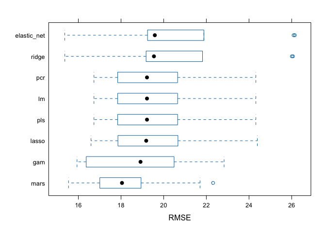

Midterm Project
================
Yuki Joyama
2024-03-19

``` r
# read RData file
df_recov <- get(load("./data/recovery.RData")) |> 
  janitor::clean_names()

head(df_recov)
```

    ##   id age gender race smoking height weight  bmi hypertension diabetes sbp ldl
    ## 1  1  56      0    1       2  170.2   78.7 27.2            0        0 120  97
    ## 2  2  70      1    1       1  169.6   73.1 25.4            1        0 134 112
    ## 3  3  57      1    1       0  168.4   77.4 27.3            1        0 131  88
    ## 4  4  53      0    1       0  166.7   76.1 27.4            0        0 115  87
    ## 5  5  59      1    1       2  173.6   70.2 23.3            0        0 127 118
    ## 6  6  60      1    3       1  162.8   75.1 28.4            0        0 129 104
    ##   vaccine severity study recovery_time
    ## 1       0        0     A            31
    ## 2       0        0     A            44
    ## 3       1        0     A            29
    ## 4       0        1     A            47
    ## 5       1        0     A            40
    ## 6       0        0     A            34

# Exploratory analysis and data visualization

``` r
# setup plot theme
theme_set(
  theme_bw() +
    theme(legend.position = "top")
  )

# check the response variable
df_recov |> 
  ggplot(aes(x = recovery_time)) +
  geom_histogram(bins = 30, color = "black", fill = "gray")
```

<!-- -->

``` r
# check correlations
# set variable types
```

# Model training
