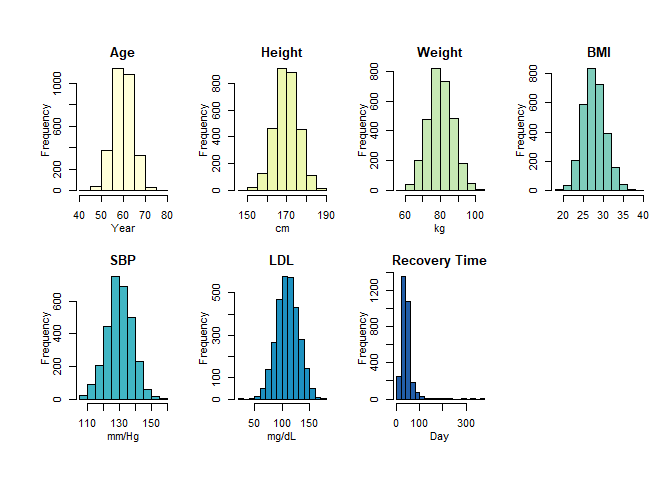

EDA
================
Yuki Joyama
2024-03-20

``` r
# read RData file
df_recov <- get(load("./data/recovery.RData")) |> 
  janitor::clean_names()

# check the response variable
# df_recov |> 
#   ggplot(aes(x = recovery_time)) +
#   geom_histogram(bins = 30, color = "black", fill = "gray")
```

# Histogram

``` r
cate_recov = df_recov |>
  select(gender, race, smoking, hypertension, diabetes, vaccine, severity, study)
conti_recov = df_recov |>
  select(age, height, weight, bmi, sbp, ldl, recovery_time)

ggplot(gather(conti_recov, cols, value), aes(x = value)) + 
       geom_histogram(binwidth = 20) + facet_grid(.~cols)
```

<!-- -->

``` r
library(Hmisc)
hist.data.frame(conti_recov)
```

<!-- -->

# Bar plot

# Correlation

``` r
numeric_df_recov <- df_recov %>%
  select_if(is.numeric)

# Compute the correlation matrix
correlation_matrix <- cor(numeric_df_recov)

# Plot the correlation matrix
corrplot(correlation_matrix, method = "circle", type = "upper", order = "hclust")
```

<!-- -->

# Table 1
