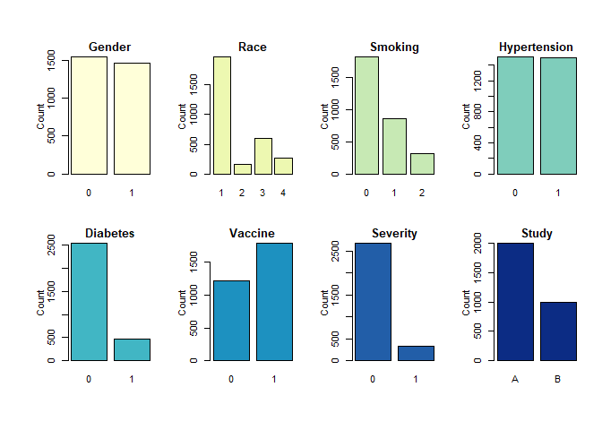

EDA
================
Yuki Joyama
2024-03-20

``` r
# read RData file
df_recov <- get(load("./data/recovery.RData")) |> 
  janitor::clean_names()

summary(df_recov)
```

    ##        id              age           gender       race     smoking 
    ##  Min.   :   1.0   Min.   :42.0   Min.   :0.0000   1:1967   0:1822  
    ##  1st Qu.: 750.8   1st Qu.:57.0   1st Qu.:0.0000   2: 158   1: 859  
    ##  Median :1500.5   Median :60.0   Median :0.0000   3: 604   2: 319  
    ##  Mean   :1500.5   Mean   :60.2   Mean   :0.4853   4: 271           
    ##  3rd Qu.:2250.2   3rd Qu.:63.0   3rd Qu.:1.0000                    
    ##  Max.   :3000.0   Max.   :79.0   Max.   :1.0000                    
    ##      height          weight            bmi         hypertension   
    ##  Min.   :147.8   Min.   : 55.90   Min.   :18.80   Min.   :0.0000  
    ##  1st Qu.:166.0   1st Qu.: 75.20   1st Qu.:25.80   1st Qu.:0.0000  
    ##  Median :169.9   Median : 79.80   Median :27.65   Median :0.0000  
    ##  Mean   :169.9   Mean   : 79.96   Mean   :27.76   Mean   :0.4973  
    ##  3rd Qu.:173.9   3rd Qu.: 84.80   3rd Qu.:29.50   3rd Qu.:1.0000  
    ##  Max.   :188.6   Max.   :103.70   Max.   :38.90   Max.   :1.0000  
    ##     diabetes           sbp             ldl           vaccine     
    ##  Min.   :0.0000   Min.   :105.0   Min.   : 28.0   Min.   :0.000  
    ##  1st Qu.:0.0000   1st Qu.:125.0   1st Qu.: 97.0   1st Qu.:0.000  
    ##  Median :0.0000   Median :130.0   Median :110.0   Median :1.000  
    ##  Mean   :0.1543   Mean   :130.5   Mean   :110.5   Mean   :0.596  
    ##  3rd Qu.:0.0000   3rd Qu.:136.0   3rd Qu.:124.0   3rd Qu.:1.000  
    ##  Max.   :1.0000   Max.   :156.0   Max.   :178.0   Max.   :1.000  
    ##     severity        study           recovery_time   
    ##  Min.   :0.000   Length:3000        Min.   :  2.00  
    ##  1st Qu.:0.000   Class :character   1st Qu.: 31.00  
    ##  Median :0.000   Mode  :character   Median : 39.00  
    ##  Mean   :0.107                      Mean   : 42.17  
    ##  3rd Qu.:0.000                      3rd Qu.: 49.00  
    ##  Max.   :1.000                      Max.   :365.00

# Histogram

``` r
cate_recov = df_recov |>
  select(gender, race, smoking, hypertension, diabetes, vaccine, severity, study)
conti_recov = df_recov |>
  select(age, height, weight, bmi, sbp, ldl, recovery_time)

#ggplot(gather(conti_recov, cols, value), aes(x = value)) + 
#       geom_histogram(binwidth = 20) + facet_grid(.~cols)

#library(Hmisc)
#hist.data.frame(conti_recov)

par(mfrow = c(2, 4),  # Layout: 2 rows, 2 columns
    oma = c(2, 2, 3, 1),  # Outer margins
    mar = c(4, 4, 2, 1),  # Inner margins
    mgp = c(2, 1, 0))     # Margins for labels and title

hist(conti_recov$age, main = "Age", xlab = "Year", ylab = "Frequency")
hist(conti_recov$height, main = "Height", xlab = "cm", ylab = "Frequency")
hist(conti_recov$weight, main = "Weight", xlab = "kl", ylab = "Frequency")
hist(conti_recov$bmi, main = "BMI", xlab = " ", ylab = "Frequency")
hist(conti_recov$sbp, main = "SBP", xlab = "mm/Hg", ylab = "Frequency")
hist(conti_recov$ldl, main = "LDL", xlab = "mg/dL", ylab = "Frequency")
hist(conti_recov$recovery_time, main = "Recovery Time", xlab = "Day", ylab = "Frequency")
```

<!-- -->

# Bar plot

``` r
cate_recov = df_recov |>
  select(gender, race, smoking, hypertension, diabetes, vaccine, severity, study)
#ggplot(gather(cate_recov, cols, value), aes(x = value)) + 
#       geom_bar(binwidth = 20) + facet_grid(.~cols)

# Setting up the plotting area
par(mfrow = c(2, 4),  # Layout: 2 rows, 4 columns
    oma = c(2, 2, 3, 1),  # Outer margins
    mar = c(4, 4, 2, 1),  # Inner margins
    mgp = c(2, 1, 0))     # Margins for labels and title

barplot(table(cate_recov$gender), main = "Gender", ylab = "Count")
barplot(table(cate_recov$race), main = "Race", ylab = "Count")
barplot(table(cate_recov$smoking), main = "Smoking", ylab = "Count")
barplot(table(cate_recov$hypertension), main = "Hypertension", ylab = "Count")
barplot(table(cate_recov$diabetes), main = "Diabetes", ylab = "Count")
barplot(table(cate_recov$vaccine), main = "Vaccine", ylab = "Count")
barplot(table(cate_recov$severity), main = "Severity", ylab = "Count")
barplot(table(cate_recov$study), main = "Study", ylab = "Count")
```

<!-- -->

# Correlation

``` r
numeric_df_recov <- df_recov |>
  mutate(race = as.numeric(race)) |>
  mutate(smoking = as.numeric(smoking)) |>
  mutate(study = as.numeric(as.factor(study))) |>
  select_if(is.numeric)


# Compute the correlation matrix
correlation_matrix <- cor(numeric_df_recov)

# Plot the correlation matrix
corrplot(correlation_matrix, method = "circle", type = "upper", order = "hclust")
```

<!-- -->

# Table 1

``` r
theme_gtsummary_journal(journal = "nejm")

table_1 = df_recov |> 
  select(!id) |> 
  mutate(
    gender = case_when(
      gender == 1 ~ "Male",
      gender == 0 ~ "Female"
    ),
    race = case_when(
      race == 1 ~ "White",
      race == 2 ~ "Asian",
      race == 3 ~ "Black",
      race == 4 ~ "Hispanic"
    ),
    smoking = case_when(
      smoking == 0 ~ "Never smoked",
      smoking == 1 ~ "Former smoker",
      smoking == 2 ~ "Current smoker"
    ), 
    hypertension = case_when(
      hypertension == 0 ~ "No hypertension",
      hypertension == 1 ~ "Hypertension"
    ),
    diabetes = case_when(
      diabetes == 0 ~ "No diabetes",
      diabetes == 1 ~ "Diabetes"
    ),
    vaccine = case_when(
      vaccine == 0 ~ "Not vaccinated",
      vaccine == 1 ~ "Vaccinated"
    ),
    severity = case_when(
      severity == 0 ~ "Not severe",
      severity == 1 ~ "Severe"
    )
  ) |> 
  tbl_summary(
    by = study,
    statistic = list(
      all_continuous() ~ "{mean} / {median} ({sd})",
      all_categorical() ~ "{n} ({p}%)"
    ),
    digits = all_continuous() ~ 1,
    label = list(
      age ~ "Age",
      gender ~ "Gender",
      race ~ "Race",
      smoking ~ "Smoking",
      height ~ "Height",
      weight ~ "Weight",
      bmi ~ "BMI",
      hypertension ~ "Hypertension",
      diabetes ~ "Diabetes",
      sbp ~ "SBP",
      ldl ~ "LDL",
      vaccine ~ "Vaccine",
      severity ~ "Severity",
      recovery_time ~ "Recovery time"
    )
  ) |> 
  modify_caption("Baseline Characteristics") |> 
  as_flex_table() |> 
  line_spacing(space = 0, part = "body")

table_1
```


