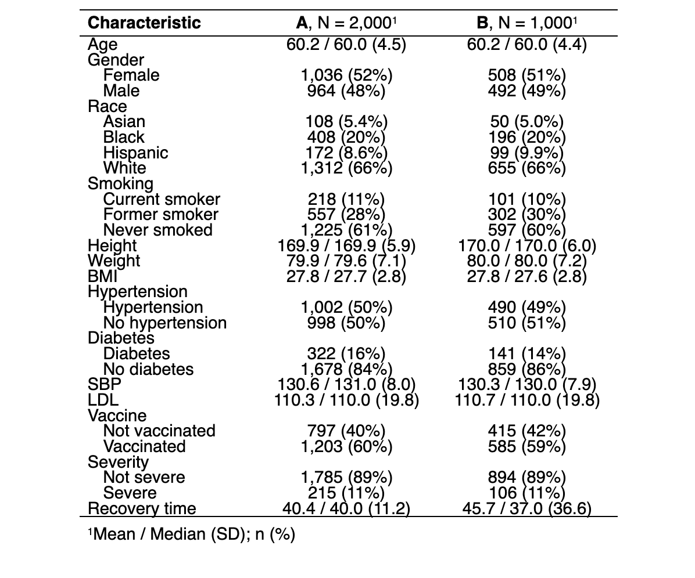
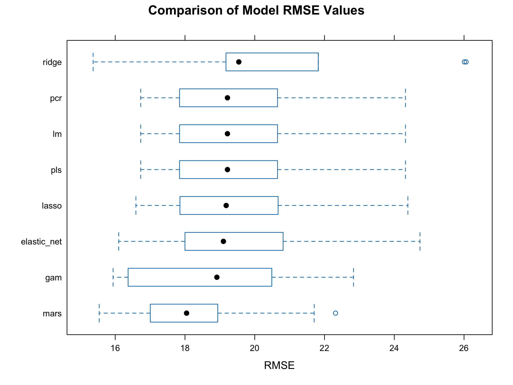

```{r setup, include=FALSE}
options(tinytex.verbose = TRUE)

knitr::opts_chunk$set(
  echo = FALSE,
  message=FALSE,
  warning=FALSE,
  results = FALSE)

library(tidyverse)
library(ggplot2)
library(corrplot)
library(gtsummary)
library(flextable)
library(rsample) 
library(caret)
library(tidymodels)
library(plotmo)
library(earth)
library(vip)

# setup plot theme
theme_set(
  theme_bw() +
    theme(legend.position = "top")
  )
```

```{r dataprep}
# read RData file
df_recov <- get(load("./data/recovery.RData")) |> 
  janitor::clean_names()

summary(df_recov)
```

# Exploratory Analysis and Data Visualization
The information of COVID-19 recovery time and other variables (id, gender, race, smoking history, height, weight, body mass index (BMI), history of hypertension and diabetes, systolic blood pressure (SBP), LDL cholesterol (LDL), vaccination status at the time of infection) is collected from two existing cohort studies. Baseline characteristics are presented in Table 1, showing that almost all characteristics are similar between the two study groups, except for COVID-19 recovery time.

Table 1: Baseline Characteristics  
{width=50%, height=50%}  


# Model Training

## Model selection

After cleanning and preprocessing the dataset, we partitioned it into an 80-20 training-test split. Then, We employed a variety of regression models to predict the time to recovery from COVID-19. The models include LM, Ridge, PLS, PCR, Lasso, Elastic Net, MARS, and GAM. Each model was trained using the train function from the caret package on the training data with 10-fold cross-validation.

LM assumes linearity, homoscedasticity, no multicollinearity, and normal distribution of residuals. Lasso has the same assumption as LM. Elastic Net is a linear regression model that combines Lasso and Ridge regularization penalties, it assumes that a balance of Lasso and Ridge penalties will produce a better model.Ridge regression sssumes multicollinearity in the data and attempts to mitigate its effects by introducing a penalty term. Principal Component Regression assumes that the principal components capture most of the variance in the predictors and that these components have a linear relationship with the outcome. Partial Least Squares assumes that the new components created from the predictors will have a linear relationship with the outcome. Gam assumes that the data can be better modeled by allowing non-linear relationships between predictors and the response. MARS is a non-parametric regression method that builds flexible models by fitting piecewise linear regressions, it asssumes that the relationships between the predictors and the outcome can be modeled with splines, which are piecewise polynomials joined at knots.

## Selection of Tuning Parameters

In predictive modeling, tuning parameters are crucial as they can significantly affect the model's performance. For our final analysis, we employed a meticulous process to identify the optimal tuning parameters for each model, aiming to strike a delicate balance between bias and variance, ultimately to improve prediction accuracy.

To select the best tuning parameters, Initially, we used a wide range and search pattern, we created a grid of potential models with different degrees and numbers of terms to prune, then used 10-fold cross-validation to select the optimal combination. After identifying promising ranges for the selected parameters where show the best cross-validation performance, we then searched parameter patterns within a narrower range and with more density by decreasing the step within each parameter sequence. For example, with the MARS model, we started with a relatively large number of maximum terms in the initial grid search to capture potential model complexity. We then narrowed down the search space for the degree of interaction and number of terms based on cross-validation performance. The best tuning parameters given by the cross-validation is: `nprune = 7`, `degree = 4`.

## Model Comparison

After fitting all the models, we used the resamples function to compare their performance based on RMSE. The performance of all models was assessed through 10-fold cross-validation on the training set. Repeated cross-validation was not employed to avoid excessive computational cost. The results of the cross-validation are presented below



This box plot illustrates the distribution of Root Mean Square Error (RMSE) values across different predictive models used to estimate the time to recovery from COVID-19. The MARS model has the lowest median RMSE, suggesting that it is the best performing model in terms of prediction accuracy on the validation sets used during cross-validation. Moreover, there is a clear distinction between the group of models with the lowest RMSE values (MARS, GAM, Elastic Net) and the other models, indicating that incorporating non-linearity and regularization seems beneficial for this dataset.

In summary, based on this plot, MARS offers the best balance between accuracy and consistency for the given dataset. However, it's important to consider other factors such as the complexity of the model, interpretability, and computational efficiency when making a final selection for practical application.

## Why choose MARS

Multivariate adaptive regression splines is an effective technique for simplifying models and constructing them. It is a nonparametric, multivariate regression method that can estimate complex nonlinear relations by a series of spline functions of the predictor variables, which makes it flexible in modeling the shape of the recovery time distribution in the COVID-19 dataset.

One of the strengths of MARS is its flexibility. It can handle various types of predictor variables, from continuous to categorical, and is adept at managing a high number of them. Its nonparametric nature is especially beneficial as it operates without presumptions about how the predictor variables are distributed. 


# Results
```{r mars, include=FALSE, echo=F, cache=T}
# read RData file
df_recov <- get(load("./data/recovery.RData")) |> 
  janitor::clean_names()

head(df_recov)

# partition (training:test=80:20)
set.seed(2024)
data_split = initial_split(df_recov, prop = .80)
# training data
df_train = training(data_split) |> 
  select(!id)
# test data
df_test = testing(data_split) |> 
  select(!id)

# set up 10-fold CV
ctrl1 <- trainControl(
  method = "cv",
  number = 10
)

# MARS
set.seed(2024)

# fit mars model
mars.fit <- train(
  x = df_train[1:14],
  y = df_train$recovery_time,
  method = "earth",
  tuneGrid = expand.grid(degree = 1:5, nprune = 2:30),
  metric = "RMSE",
  trControl = ctrl1
)
```

Our final MARS model is as follows:   

$\hat{y}$ = `r round(coef(mars.fit$finalModel)[1], 3)` + `r round(coef(mars.fit$finalModel)[2], 3)` $\times$ h(30.3 - bmi) + `r round(coef(mars.fit$finalModel)[3], 3)` $\times$ h(bmi - 30.3) * studyB + `r round(coef(mars.fit$finalModel)[4], 3)` $\times$ vaccine + `r round(coef(mars.fit$finalModel)[5], 3)` $\times$ h(164 - height) * h(bmi - 30.3) * studyB + `r round(coef(mars.fit$finalModel)[6], 3)` $\times$ h(bmi - 25.7) + `r round(coef(mars.fit$finalModel)[7], 3)` $\times$ h(87.6 - weight) * h(bmi - 30.3) * studyB, where $h(.)$ is a hinge function   

Table 2: Summary of the MARS model
```{r table2, echo=FALSE, message=FALSE, warnings=FALSE, results='asis'}
require(pander)
panderOptions('table.split.table', Inf)

my.data <- "
Equation        | Coefficients        
(Intercept)      | 22.435204 
vaccine      | -6.264022   
h(bmi-25.7) | 4.898496    
h(30.3-bmi)   | 3.574364   
h(bmi-30.3) * studyB| 9.782606
h(164-height) * h(bmi-30.3) * studyB| 2.990502
h(87.6-weight) * h(bmi-30.3) * studyB| -2.640353
"
df <- read.delim(textConnection(my.data), header=FALSE, sep="|", strip.white=TRUE, stringsAsFactors=FALSE)
names(df) <- unname(as.list(df[1,])) # put headers on
df <- df[-1,] # remove first row
row.names(df)<-NULL
pander(df, style = 'rmarkdown')
```

The summary of the final MARS model is shown in Table 2. Vaccinated people have `r -round(coef(mars.fit$finalModel)[4], 3)` shorter recovery time (days) compared to non-vaccinated ones, holding other variables constant. The model shows that BMI has two knots (25.7 and 30.3). This can be expressed as follows:     

$$
\text{Recovery time} = 
\begin{cases}
22.435 & \text{for } \text{BMI}\leq 25.7\\
22.435 + 4.898 \text{ (BMI - 25.7)} & \text{for } 25.7\leq \text{BMI}\leq 30.3\\
22.435 + 3.574\text{ (30.3 - BMI)} & \text{for } 30.3\leq \text{BMI}
\end{cases}
$$  

All else being equal, if BMI is in the range (25.7, 30.3), the recovery time increases by `r round(coef(mars.fit$finalModel)[6], 3)` days for every unit increase in BMI; for those with BMI larger than 30.3, the recovery time increases by `r round(coef(mars.fit$finalModel)[2], 3)` days for every unit increase in BMI. The model also tells us that there are interactions between h(bmi - 30.3) and studyB; h(164 - height), h(bmi - 30.3) and studyB; h(87.6 - weight), h(bmi - 30.3) and studyB. We will discuss this in the later section ("Additional Considerations"). Given the results, we can infer that the followings are the important risk factors for longer recovery time:  

* No history of vaccination  
* BMI over 25.7  
* BMI over 30.3 in Study B  
* Height under 164 cm and BMI over 30.3 in Study B  

Figure 2 illustrates that study B, BMI, height, weight, and vaccination status have the non-zero importance value in the final model.  

{width=50%, height=30%}  


# Conclusions


# Additional Considerations


