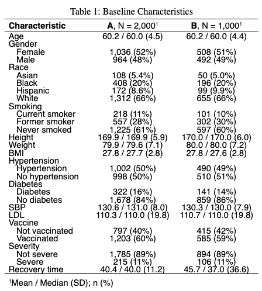

```{r setup, include=FALSE}
options(tinytex.verbose = TRUE)

knitr::opts_chunk$set(
  echo = FALSE,
  message=FALSE,
  warning=FALSE,
  results = FALSE)

library(tidyverse)
library(ggplot2)
library(corrplot)
library(gtsummary)
library(flextable)
library(rsample) 
library(caret)
library(tidymodels)
library(plotmo)
library(earth)
library(vip)

# setup plot theme
theme_set(
  theme_bw() +
    theme(legend.position = "top")
  )
```

```{r dataprep}
# read RData file
df_recov <- get(load("./data/recovery.RData")) |> 
  janitor::clean_names()

summary(df_recov)
```

# Exploratory Analysis and Data Visualization
**In this section, use appropriate visualization techniques to explore the dataset and identify any patterns or relationships in the data.**  
The information of COVID-19 recovery time and other variables (id, gender, race, smoking history, height, weight, body mass index (BMI), history of hypertension and diabetes, systolic blood pressure (SBP), LDL cholesterol (LDL), vaccination status at the time of infection) is collected from two existing cohort studies. Baseline characteristics are presented in Table 1, showing that almost all characteristics are similar between the two study groups, except for COVID-19 recovery time.

{width=50%, height=50%}


# Model Training
In this report, we constructed 
**In this section, describe the models you used to predict the time to recovery from COVID-19. Briefly state the assumptions made by using the models. Provide a detailed description of the model training procedure and how you obtained the final model.**


# Results
**In this section, report the final model you built to predict the time to recovery from COVID-19. Interpret the model and assess its performance.**


# Conclusions
**In this section, summarize your findings from the model analysis and discuss the insights gained into predicting time to recovery from COVID-19.**

# Additional Considerations
**In your modeling efforts, did you include "study" as a predictor variable? Provide a rationale for your decision, considering the variable's relevance and potential impact on model accuracy and interpretability.**


