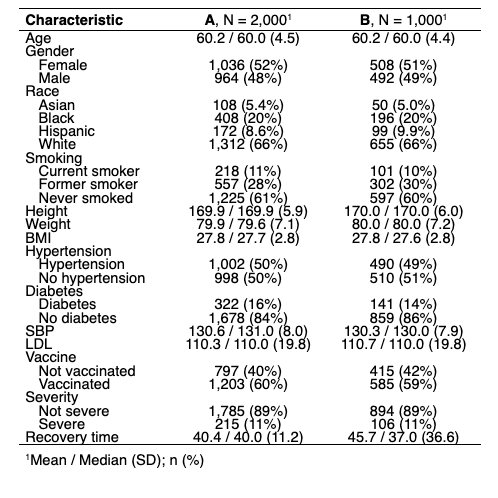
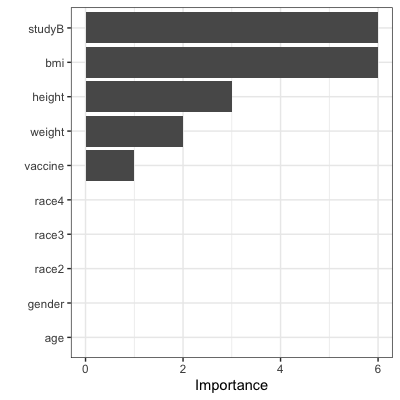

```{r setup, include=FALSE}
options(tinytex.verbose = TRUE)

knitr::opts_chunk$set(
  echo = FALSE,
  message=FALSE,
  warning=FALSE,
  results = FALSE)

library(tidyverse)
library(ggplot2)
library(corrplot)
library(gtsummary)
library(flextable)
library(rsample) 
library(caret)
library(tidymodels)
library(plotmo)
library(earth)
library(vip)

# setup plot theme
theme_set(
  theme_bw() +
    theme(legend.position = "top")
  )
```

```{r dataprep}
# read RData file
df_recov <- get(load("./data/recovery.RData")) |> 
  janitor::clean_names()

summary(df_recov)
```

# Exploratory Analysis and Data Visualization
The information of COVID-19 recovery time and other variables (id, gender, race, smoking history, height, weight, body mass index (BMI), history of hypertension and diabetes, systolic blood pressure (SBP), LDL cholesterol (LDL), vaccination status at the time of infection) is collected from two existing cohort studies. Baseline characteristics are presented in Table 1, showing that almost all characteristics are similar between the two study groups, except for COVID-19 recovery time.

Table 1: Baseline Characteristics  
{width=50%, height=50%}  


# Model Training
**In this section, describe the models you used to predict the time to recovery from COVID-19. Briefly state the assumptions made by using the models. Provide a detailed description of the model training procedure and how you obtained the final model.**  


# Results
```{r mars, include=FALSE, echo=F, cache=T}
# read RData file
df_recov <- get(load("./data/recovery.RData")) |> 
  janitor::clean_names()

head(df_recov)

# partition (training:test=80:20)
set.seed(2024)
data_split = initial_split(df_recov, prop = .80)
# training data
df_train = training(data_split) |> 
  select(!id)
# test data
df_test = testing(data_split) |> 
  select(!id)

# set up 10-fold CV
ctrl1 <- trainControl(
  method = "cv",
  number = 10
)

# MARS
set.seed(2024)

# fit mars model
mars.fit <- train(
  x = df_train[1:14],
  y = df_train$recovery_time,
  method = "earth",
  tuneGrid = expand.grid(degree = 1:5, nprune = 2:30),
  metric = "RMSE",
  trControl = ctrl1
)
```

Our final MARS model is as follows:   

$\hat{y}$ = `r round(coef(mars.fit$finalModel)[1], 3)` + `r round(coef(mars.fit$finalModel)[2], 3)` $\times$ h(30.3 - bmi) + `r round(coef(mars.fit$finalModel)[3], 3)` $\times$ h(bmi - 30.3) * studyB + `r round(coef(mars.fit$finalModel)[4], 3)` $\times$ vaccine + `r round(coef(mars.fit$finalModel)[5], 3)` $\times$ h(164 - height) * h(bmi - 30.3) * studyB + `r round(coef(mars.fit$finalModel)[6], 3)` $\times$ h(bmi - 25.7) + `r round(coef(mars.fit$finalModel)[7], 3)` $\times$ h(87.6 - weight) * h(bmi - 30.3) * studyB  
where $h(.)$ is hinge function.   

The summary of the final MARS model is shown in Table 2.   

Figure 2 illustrates that study B, BMI, height, weight, and vaccination status have the non-zero importance value in the final model.  

{width=50%, height=30% }

Table 2: Summary of the MARS model
```{r table2, echo=FALSE, message=FALSE, warnings=FALSE, results='asis'}
require(pander)
panderOptions('table.split.table', Inf)

my.data <- "
Equation        | Coefficients        
(Intercept)      | 22.435204 
vaccine      | -6.264022   
h(bmi-25.7) | 4.898496    
h(30.3-bmi)   | 3.574364   
h(bmi-30.3) * studyB| 9.782606
h(164-height) * h(bmi-30.3) * studyB| 2.990502
h(87.6-weight) * h(bmi-30.3) * studyB| -2.640353
"
df <- read.delim(textConnection(my.data), header=FALSE, sep="|", strip.white=TRUE, stringsAsFactors=FALSE)
names(df) <- unname(as.list(df[1,])) # put headers on
df <- df[-1,] # remove first row
row.names(df)<-NULL
pander(df, style = 'rmarkdown')
```

# Conclusions
**In this section, summarize your findings from the model analysis and discuss the insights gained into predicting time to recovery from COVID-19.**

# Additional Considerations
**In your modeling efforts, did you include "study" as a predictor variable? Provide a rationale for your decision, considering the variable's relevance and potential impact on model accuracy and interpretability.**


