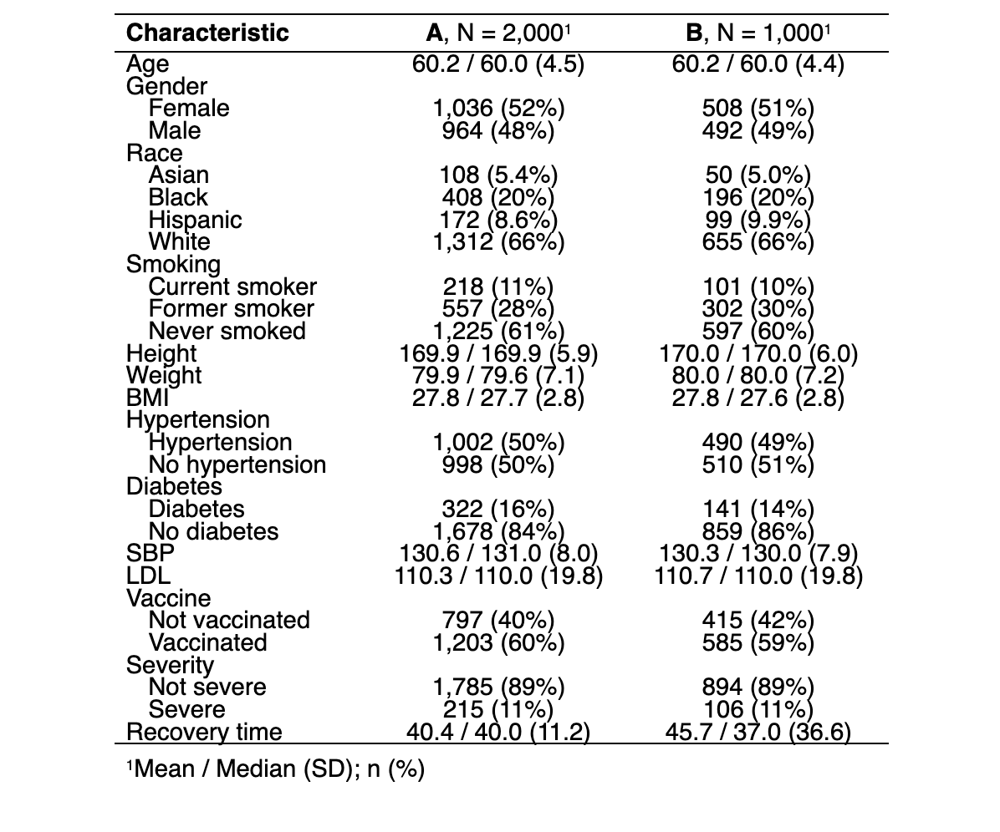

# Exploratory Analysis and Data Visualization
The information of COVID-19 recovery time and other variables (id, gender, race, smoking history, height, weight, body mass index (BMI), history of hypertension and diabetes, systolic blood pressure (SBP), LDL cholesterol (LDL), vaccination status at the time of infection) is collected from two existing cohort studies. Baseline characteristics are presented in Table 1, showing that almost all characteristics are similar between the two study groups, except for COVID-19 recovery time. The distribution of each variable is shown in Figure 1.

Table 1: Baseline Characteristics

{width=50%, height=50%}  

\begin{figure}[ht]
\centering
\includegraphics[width=0.45\textwidth]{./plots/Rplot04.png}
\hspace{0.5cm} % Adds space between the two figures
\includegraphics[width=0.45\textwidth]{./plots/Rplot06.png}
\caption{(a) Histogram of Continuous Variables (b) Bar Plot of Categorical Variables}
\end{figure}

# Model Training

## Selection of Tuning Parameters

In predictive modeling, tuning parameters are crucial as they can significantly affect the model's performance. To select the best tuning parameters, with the MARS model (Figure 2(a)), we started with a relatively large number of maximum terms in the initial grid search to capture potential model complexity. We created a grid of potential models with degrees from 1 to 5 and numbers of terms to prune from 2 to 30. Then, we narrowed down the search space for the degree of interaction and number of terms based on cross-validation performance. The best tuning parameters given by the cross-validation is: `nprune = 7`, `degree = 4`.

## Model Comparison

After fitting all the models, we used the resamples function to compare their performance based on RMSE. The performance of all models was assessed through 10-fold cross-validation on the training set. The results of the cross-validation are presented below:

\begin{figure}[ht]
\centering
\includegraphics[width=0.5\textwidth]{./plots/mars.png}
\hspace{0.1cm} % Adds space between the two figures
\includegraphics[width=0.45\textwidth]{./plots/modelcomp.png}
\caption{(a) MARS Model Tunning (b) Model Comparision}
\end{figure}

Figure 2(b) illustrates the distribution of Root Mean Square Error (RMSE) values across different predictive models used to estimate the time to recovery from COVID-19. We use earth package to fit the MARS model. The MARS model has the lowest median RMSE, suggesting that it is the best performing model in terms of prediction accuracy on the validation sets used during cross-validation. Moreover, there is a clear distinction between the group of models with the lowest RMSE values (MARS, GAM) and the other models, indicating that incorporating non-linearity and regularization seems beneficial for this dataset.

Conclusively, MARS emerges as the most accurate and consistent model for this dataset. This technique excels in model simplification and construction, utilizing spline functions of predictor variables to estimate complex nonlinear relationships, thereby offering flexibility in modeling the recovery time distribution of the COVID-19 dataset.

MARS's strength lies in its adaptability, capable of handling both continuous and categorical predictor variables, even in large numbers. Its nonparametric approach, free from predefined assumptions on the distribution of predictor variables, further underscores its utility in complex predictive scenarios. 

## Model Selection

After cleansing and preprocessing the dataset, we divided it into training and testing subsets using an 80-20 split. Subsequently, we explored a diverse array of regression models to forecast COVID-19 recovery times. These models are Linear Model, Lasso Regression, Elastic Net, Ridge Regression, Partial Least Squares (PLS), Principal Component Regression (PCR), Generalized Additive Models (GAM), and Multivariate Adaptive Regression Splines (MARS). Utilizing the caret package's train function, each model underwent training on the training dataset, incorporating 10-fold cross-validation to enhance model reliability and performance assessment.

Because MARS employs piecewise linear regressions to accommodate non-linear predictor-outcome relationships, utilizing splines for model construction, and the MARS model has the lowest median RMSE, we choose MARS as our final model.

# Results

Our final MARS model is as follows:   

$\hat{y}$ = 22.435 + 3.574 $\times$ h(30.3 - bmi) + 9.783 $\times$ h(bmi - 30.3) * studyB + -6.264 $\times$ vaccine + 2.991 $\times$ h(164 - height) * h(bmi - 30.3) * studyB + 4.898 $\times$ h(bmi - 25.7) + -2.64 $\times$ h(87.6 - weight) * h(bmi - 30.3) * studyB, where $h(.)$ is a hinge function   

Table 2: Summary of the MARS model

|               Equation                | Coefficients |
|:-------------------------------------:|:------------:|
|              (Intercept)              |  22.435204   |
|                vaccine                |  -6.264022   |
|              h(bmi-25.7)              |   4.898496   |
|              h(30.3-bmi)              |   3.574364   |
|         h(bmi-30.3) * studyB          |   9.782606   |
| h(164-height) * h(bmi-30.3) * studyB  |   2.990502   |
| h(87.6-weight) * h(bmi-30.3) * studyB |  -2.640353   |

The summary of the final MARS model is shown in Table 2. Vaccinated people have 6.264 shorter recovery time (days) compared to non-vaccinated ones, holding other variables constant. The model shows that BMI has two knots (25.7 and 30.3). This can be expressed as follows:     

$$
\text{Recovery time} = 
\begin{cases}
22.435 & \text{for } \text{BMI}\leq 25.7\\
22.435 + 4.898 \text{ (BMI - 25.7)} & \text{for } 25.7\leq \text{BMI}\leq 30.3\\
22.435 + 3.574\text{ (30.3 - BMI)} & \text{for } 30.3\leq \text{BMI}
\end{cases}
$$  

All else being equal, if BMI is in the range (25.7, 30.3), the recovery time increases by 4.898 days for every unit increase in BMI; for those with BMI larger than 30.3, the recovery time increases by 3.574 days for every unit increase in BMI. The model also tells us that there are interactions between h(bmi - 30.3) and studyB; h(164 - height), h(bmi - 30.3) and studyB; h(87.6 - weight), h(bmi - 30.3) and studyB. We will discuss this in the later section ("Additional Considerations"). Given the results, we can infer that the followings are the important risk factors for longer recovery time:  

\text{*} No history of vaccination \
\text{*} BMI over 25.7 \
\text{*} BMI over 30.3 in Study B \
\text{*} Height under 164 cm and BMI over 30.3 in Study B  

Figure 3 illustrates that study B, BMI, height, weight, and vaccination status have the non-zero importance value in the final model.  

\begin{figure}[ht]
    \centering
    \includegraphics[width=0.5\textwidth, height=0.2\textheight, keepaspectratio=false]{./plots/Rplot.png}
    \caption{Variance Importance Plot}
    \label{fig:varianceimportance}
\end{figure}

# Conclusions

Our analysis using the Multivariate Adaptive Regression Splines (MARS) model has provided significant insights into factors influencing COVID-19 recovery times. Key findings include the substantial impact of vaccination, which significantly reduces recovery time, highlighting the critical role of immunization in managing COVID-19 outcomes. The model also reveals the nuanced effects of body mass index (BMI) on recovery, with distinct thresholds where recovery time increases, underscoring the importance of metabolic health in the COVID-19 recovery process.

Furthermore, the interaction between BMI, study variables, and demographic factors such as height and weight, suggests a complex relationship affecting recovery time. These interactions emphasize the need for a tailored approach to treatment, considering the multifaceted nature of individual health profiles.

In conclusion, our model analysis underscores the necessity of vaccination and the management of metabolic health in improving COVID-19 recovery times. It also highlights the importance of personalized healthcare strategies that account for the interplay of various factors affecting individual recovery trajectories. Future research should focus on understanding the mechanisms behind these associations, to develop more effective, targeted interventions for COVID-19 recovery. 

# Additional Considerations

In our work with the Multivariate Adaptive Regression Splines (MARS) model for predicting COVID-19 recovery times, we chose to include "study" as a predictor. This decision was based on recognizing that factors like socioeconomic status, geography, and demographics can greatly affect recovery outcomes. These factors vary from one study to another but weren't directly included in our datasets. Our analysis showed that the "study" variable significantly interacts with other variables, especially BMI, highlighting that the influence of certain predictors on recovery time can change depending on the study context. This finding underlines the importance of considering the "study" variable to accurately capture the diverse experiences of COVID-19 recovery.

To deepen our understanding of these effects, a stratified analysis is suggested as a future step. Such an analysis would allow us to dissect how recovery dynamics change across distinct study conditions, providing a better understanding of the factors influencing recovery times. By segmenting data according to specific study characteristics, we can tailor our model to more precisely predict the COVID-19 recovery time. 

